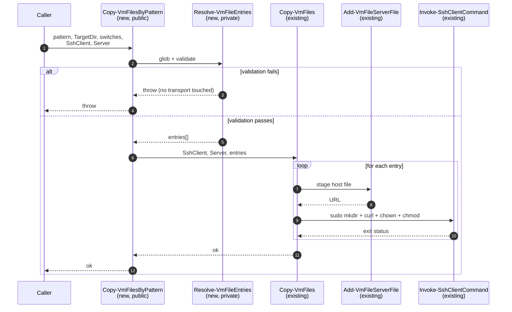
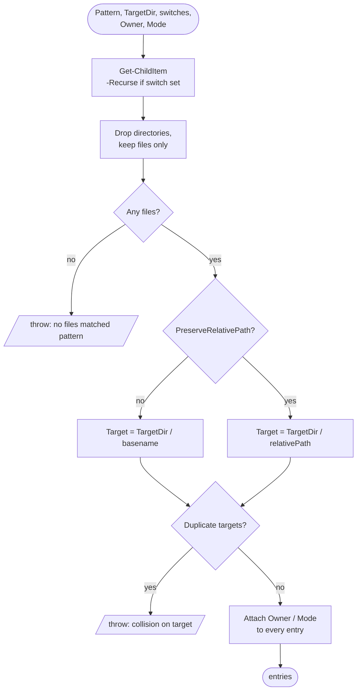
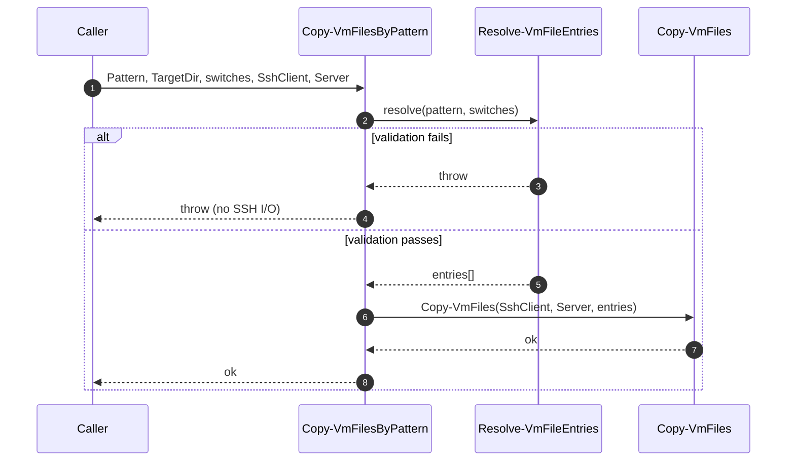

# Plan: Bulk VM file transfer

See [problem.md](problem.md) for context, scope, design decisions and
acceptance criteria. This plan turns those decisions into the smallest
committable steps that each carry their own tests.

## Index

- [Shape of the change](#shape-of-the-change)
- [Step 1: Private resolver `Resolve-VmFileEntries`](#step-1-private-resolver-resolve-vmfileentries)
- [Step 2: Public `Copy-VmFilesByPattern` + module export](#step-2-public-copy-vmfilesbypattern--module-export)
- [Step 3: Integration tests against the Docker target](#step-3-integration-tests-against-the-docker-target)

## Shape of the change

The feature splits into two layers: a pure host-side resolver +
validator, and a thin public wrapper that hands its output to the
existing [Copy-VmFiles](../../../../Infrastructure.HyperV/Public/FileTransfer/Copy-VmFiles.ps1).
Per [problem.md design decisions](problem.md#design-decisions), all
shape checks run in the resolver before any transport step.

## Step 1: Private resolver `Resolve-VmFileEntries`

**Reason.** Isolating wildcard resolution + the
[pre-flight validation pass](problem.md#scope) into a private,
SSH-free helper makes the rules deterministically unit-testable
without a VM and keeps the public wrapper trivial.

**Files.**

- New: `Infrastructure.HyperV/Private/FileTransfer/Resolve-VmFileEntries.ps1`
- New: `Tests/Resolve-VmFileEntries.Tests.ps1`

**Behaviour.**

- Parameters: `Pattern`, `TargetDir`, `[switch] $Recurse`,
  `[switch] $PreserveRelativePath`, `Owner`, `Mode`.
- Resolves the pattern host-side via `Get-ChildItem` (with `-Recurse`
  iff the switch is set). Filters out directories.
- Computes per-match VM target paths in the requested mode, using
  forward slashes (Linux target).
- Runs the validation pass in this order, throwing on the first
  failure with a descriptive message:
  1. At least one file matched.
  2. No duplicate VM target paths (catches flatten basename
     collisions and `-PreserveRelativePath` collapses).
- Returns an array of `[PSCustomObject]` entries shaped exactly as
  [Copy-VmFiles](../../../../Infrastructure.HyperV/Public/FileTransfer/Copy-VmFiles.ps1)
  expects: `Source`, `Target`, `Owner`, `Mode`.

**Tests (unit).** Tests dot-source the helper directly, with no
module load required.

- Successful resolution: non-recursive flatten, recursive flatten,
  recursive preserve-relative-path (asserts target paths and entry
  fields).
- `Owner` / `Mode` defaults applied when not specified; explicit
  values propagated to every entry.
- Validation failures (each asserted to throw before any return
  value): zero matches; flatten basename collision across
  subdirectories; preserve-mode duplicate target path; pattern that
  matches only directories.
- Cross-platform path safety: returned `Target` values use `/`,
  never `\`.

**Mermaid.**

**README.** No change yet; the helper is private.

## Step 2: Public `Copy-VmFilesByPattern` + module export

**Reason.** Provides the user-facing entry point and wires the
resolver to the existing transport. Manifest export ships in the
same commit because the repo's shared `Module.Tests.ps1` enforces
`FunctionsToExport` / `Export-ModuleMember` parity (see the
[psd1 comment block](../../../../Infrastructure.HyperV/Infrastructure.HyperV.psd1)).

**Files.**

- New: `Infrastructure.HyperV/Public/FileTransfer/Copy-VmFilesByPattern.ps1`
- Edit: `Infrastructure.HyperV/Infrastructure.HyperV.psd1`
  (add to `FunctionsToExport`).
- Edit: `Infrastructure.HyperV/Infrastructure.HyperV.psm1`
  (add to `Export-ModuleMember`).
- New: `Tests/Copy-VmFilesByPattern.Tests.ps1`
- Edit: `README.md` (add the new function to the feature list,
  alongside `Copy-VmFiles`).

**Behaviour.**

- Parameters: `SshClient`, `Server`, `Pattern`, `TargetDir`,
  `[switch] $Recurse`, `[switch] $PreserveRelativePath`, `Owner`,
  `Mode`.
- Calls `Resolve-VmFileEntries` with the file-selection parameters.
  Any throw propagates unchanged (validation surface stays in one
  place).
- Forwards the resulting entries plus `SshClient` / `Server` to
  `Copy-VmFiles`. No additional logic in this layer.

**Tests (unit).**

- Stub `Resolve-VmFileEntries` and `Copy-VmFiles` at the top of the
  test file (same pattern used by
  [Copy-VmFiles.Tests.ps1](../../../../Tests/Copy-VmFiles.Tests.ps1))
  and dot-source the new public function.
- Happy path: resolver returns N entries, assert `Copy-VmFiles` is
  invoked once with exactly those entries plus the supplied
  `SshClient` / `Server`.
- Validation failure: stub `Resolve-VmFileEntries` to throw; assert
  the same exception propagates **and** `Copy-VmFiles` is asserted
  `-Times 0` (this is the key contract: no transport on rejection).
- Parameter forwarding: `-Recurse`, `-PreserveRelativePath`, `Owner`,
  `Mode` all reach the resolver verbatim.

**Mermaid.**

**README.** Add a one-liner under the file-transfer section pointing
at the new function and noting its relation to `Copy-VmFiles`.

## Step 3: Integration tests against the Docker target

**Reason.** Validates the happy paths and the file-vs-directory
filter against a real SSH target, as required by the
[acceptance criteria](problem.md#acceptance-criteria). Rejection
paths are intentionally not retested here - they are covered
deterministically by Step 1's unit tests.

**Files.**

- New: `Tests/Integration.DockerTarget/Copy-VmFilesByPattern.Tests.ps1`
- Edit: `README.md` (mention the new integration suite if it adds a
  previously absent test category; otherwise no change).

**Scenarios (each one a separate `It` against the live container).**

1. Non-recursive wildcard, flatten mode, flat source directory.
2. Recursive wildcard, flatten mode, source tree at least two
   levels deep.
3. Recursive wildcard with `-PreserveRelativePath`, asserting the
   host subtree is mirrored under `TargetDir` (file at depth >= 2).
4. Explicit `Owner` and `Mode` propagate uniformly to every file
   on the VM.
5. Pattern whose matches include directories transfers only the
   files; the directories are not created as empty entries.

**Verification on the VM** (via the existing
[Invoke-SshClientCommand](../../../../Infrastructure.HyperV/Public/Ssh/Invoke-SshClientCommand.ps1)):
`stat -c '%a %U:%G %n'` for mode + owner, `cat` (or `sha256sum`)
for contents, `find` for the expected target tree.

**README.** No change unless this introduces a new top-level test
category; the existing test-running instructions already cover the
Docker-target runner.
