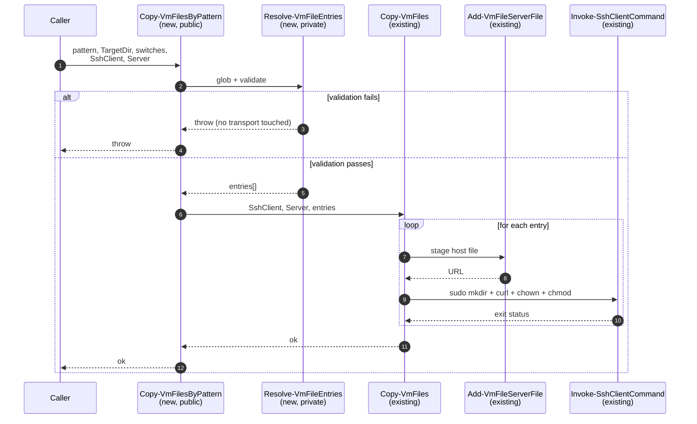
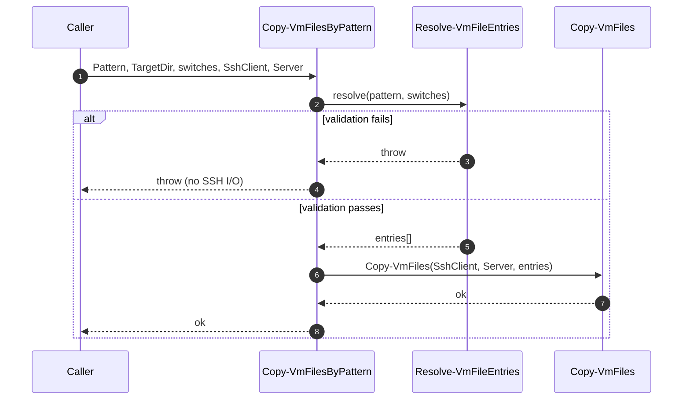
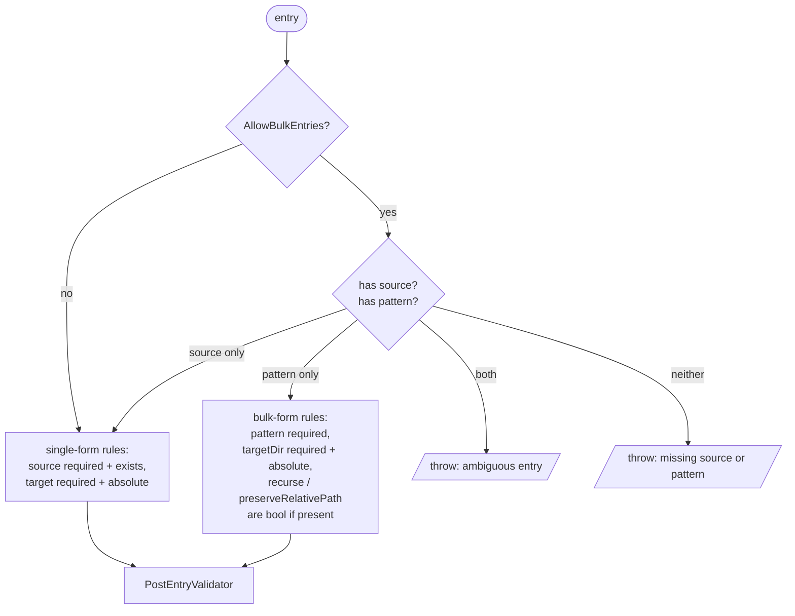

# Plan: Bulk VM file transfer

See [problem.md](problem.md) for context, scope, design decisions and
acceptance criteria. This plan turns those decisions into the smallest
committable steps that each carry their own tests.

## Index

- [Shape of the change](#shape-of-the-change)
- [Step 1: Private resolver `Resolve-VmFileEntries`](#step-1-private-resolver-resolve-vmfileentries)
- [Step 2: Public `Copy-VmFilesByPattern` + module export](#step-2-public-copy-vmfilesbypattern--module-export)
- [Step 3: Integration tests against the Docker target](#step-3-integration-tests-against-the-docker-target)
- [Step 4: Schema-level bulk-entry support in `Assert-VmFilesField`](#step-4-schema-level-bulk-entry-support-in-assert-vmfilesfield)

## Shape of the change

The feature splits into two layers: a pure host-side resolver +
validator, and a thin public wrapper that hands its output to the
existing [Copy-VmFiles](../../../../Infrastructure.HyperV/Public/FileTransfer/Copy-VmFiles.ps1).
Per [problem.md design decisions](problem.md#design-decisions), all
shape checks run in the resolver before any transport step.

## Step 1: Private resolver `Resolve-VmFileEntries`

**Reason.** Isolating wildcard resolution + the
[pre-flight validation pass](problem.md#scope) into a private,
SSH-free helper makes the rules deterministically unit-testable
without a VM and keeps the public wrapper trivial.

**Files.**

- New: `Infrastructure.HyperV/Private/FileTransfer/Resolve-VmFileEntries.ps1`
- New: `Tests/Resolve-VmFileEntries.Tests.ps1`

**Behaviour.**

- Parameters: `Pattern`, `TargetDir`, `[switch] $Recurse`,
  `[switch] $PreserveRelativePath`, `Owner`, `Mode`.
- Resolves the pattern host-side via `Get-ChildItem` (with `-Recurse`
  iff the switch is set). Filters out directories.
- Computes per-match VM target paths in the requested mode, using
  forward slashes (Linux target).
- Runs the validation pass in this order, throwing on the first
  failure with a descriptive message:
  1. At least one file matched.
  2. No duplicate VM target paths (catches flatten basename
     collisions and `-PreserveRelativePath` collapses).
- Returns an array of `[PSCustomObject]` entries shaped exactly as
  [Copy-VmFiles](../../../../Infrastructure.HyperV/Public/FileTransfer/Copy-VmFiles.ps1)
  expects: `Source`, `Target`, `Owner`, `Mode`.

**Tests (unit).** Tests dot-source the helper directly, with no
module load required.

- Successful resolution: non-recursive flatten, recursive flatten,
  recursive preserve-relative-path (asserts target paths and entry
  fields).
- `Owner` / `Mode` defaults applied when not specified; explicit
  values propagated to every entry.
- Validation failures (each asserted to throw before any return
  value): zero matches; flatten basename collision across
  subdirectories; preserve-mode duplicate target path; pattern that
  matches only directories.
- Cross-platform path safety: returned `Target` values use `/`,
  never `\`.

**Mermaid.**

**README.** No change yet; the helper is private.

## Step 2: Public `Copy-VmFilesByPattern` + module export

**Reason.** Provides the user-facing entry point and wires the
resolver to the existing transport. Manifest export ships in the
same commit because the repo's shared `Module.Tests.ps1` enforces
`FunctionsToExport` / `Export-ModuleMember` parity (see the
[psd1 comment block](../../../../Infrastructure.HyperV/Infrastructure.HyperV.psd1)).

**Files.**

- New: `Infrastructure.HyperV/Public/FileTransfer/Copy-VmFilesByPattern.ps1`
- Edit: `Infrastructure.HyperV/Infrastructure.HyperV.psd1`
  (add to `FunctionsToExport`).
- Edit: `Infrastructure.HyperV/Infrastructure.HyperV.psm1`
  (add to `Export-ModuleMember`).
- New: `Tests/Copy-VmFilesByPattern.Tests.ps1`
- Edit: `README.md` (add the new function to the feature list,
  alongside `Copy-VmFiles`).

**Behaviour.**

- Parameters: `SshClient`, `Server`, `Pattern`, `TargetDir`,
  `[switch] $Recurse`, `[switch] $PreserveRelativePath`, `Owner`,
  `Mode`.
- Calls `Resolve-VmFileEntries` with the file-selection parameters.
  Any throw propagates unchanged (validation surface stays in one
  place).
- Forwards the resulting entries plus `SshClient` / `Server` to
  `Copy-VmFiles`. No additional logic in this layer.

**Tests (unit).**

- Stub `Resolve-VmFileEntries` and `Copy-VmFiles` at the top of the
  test file (same pattern used by
  [Copy-VmFiles.Tests.ps1](../../../../Tests/Copy-VmFiles.Tests.ps1))
  and dot-source the new public function.
- Happy path: resolver returns N entries, assert `Copy-VmFiles` is
  invoked once with exactly those entries plus the supplied
  `SshClient` / `Server`.
- Validation failure: stub `Resolve-VmFileEntries` to throw; assert
  the same exception propagates **and** `Copy-VmFiles` is asserted
  `-Times 0` (this is the key contract: no transport on rejection).
- Parameter forwarding: `-Recurse`, `-PreserveRelativePath`, `Owner`,
  `Mode` all reach the resolver verbatim.

**Mermaid.**

**README.** Add a one-liner under the file-transfer section pointing
at the new function and noting its relation to `Copy-VmFiles`.

## Step 3: Integration tests against the Docker target

**Reason.** Validates the happy paths and the file-vs-directory
filter against a real SSH target, as required by the
[acceptance criteria](problem.md#acceptance-criteria). Rejection
paths are intentionally not retested here - they are covered
deterministically by Step 1's unit tests.

**Files.**

- New: `Tests/Integration.DockerTarget/Copy-VmFilesByPattern.Tests.ps1`
- Edit: `README.md` (mention the new integration suite if it adds a
  previously absent test category; otherwise no change).

**Scenarios (each one a separate `It` against the live container).**

1. Non-recursive wildcard, flatten mode, flat source directory.
2. Recursive wildcard, flatten mode, source tree at least two
   levels deep.
3. Recursive wildcard with `-PreserveRelativePath`, asserting the
   host subtree is mirrored under `TargetDir` (file at depth >= 2).
4. Explicit `Owner` and `Mode` propagate uniformly to every file
   on the VM.
5. Pattern whose matches include directories transfers only the
   files; the directories are not created as empty entries.

**Verification on the VM** (via the existing
[Invoke-SshClientCommand](../../../../Infrastructure.HyperV/Public/Ssh/Invoke-SshClientCommand.ps1)):
`stat -c '%a %U:%G %n'` for mode + owner, `cat` (or `sha256sum`)
for contents, `find` for the expected target tree.

**README.** No change unless this introduces a new top-level test
category; the existing test-running instructions already cover the
Docker-target runner.

## Step 4: Schema-level bulk-entry support in `Assert-VmFilesField`

**Reason.** Steps 1-3 ship the bulk transport for code-driven callers.
Config-driven callers (Vm-Provisioner, eventually Vm-Users) express
their copy intent as JSON `files` arrays whose entries are validated
by [Assert-VmFilesField](../../../../Infrastructure.HyperV/Public/FileTransfer/Assert-VmFilesField.ps1).
That validator hard-codes `source` + `target` as required, so a bulk
entry `{ pattern, targetDir, ... }` cannot reach `Copy-VmFilesByPattern`
through any of those callers today. This step closes the schema gap so
the transport from Steps 1-3 is actually reachable from a VM config.

**Files.**

- Edit: `Infrastructure.HyperV/Public/FileTransfer/Assert-VmFilesField.ps1`
- Edit: `Tests/Assert-VmFilesField.Tests.ps1`
- Edit: `Infrastructure.HyperV/Infrastructure.HyperV.psd1`
  (`ModuleVersion` bump - additive change to a public validator, so a
  minor bump).
- Edit: `README.md` - extend the `Assert-VmFilesField` row in the
  functions table to mention the bulk-entry form, and the
  `Install-Module -MinimumVersion` line to match the new module version.

**Behaviour.**

- Add a new opt-in switch on `Assert-VmFilesField`, e.g.
  `-AllowBulkEntries`. Default off, so every existing caller (notably
  Vm-Users) keeps behaving exactly as today - this is the
  backward-compatibility guarantee.
- When the switch is **off**: function behaves as it does in 0.4.0.
  No change for current consumers.
- When the switch is **on**, per-entry discriminator:
  - Entry has `source` => existing single-form path. Unchanged rules:
    `source` is a non-empty string and exists on host; `target` is a
    non-empty absolute Linux path; sub-fields are a subset of
    `-AllowedSubFields` (still single-form's allow-list).
  - Entry has `pattern` => bulk form. Required: `pattern` is a
    non-empty string; `targetDir` is a non-empty absolute Linux path.
    Optional: `recurse` is `[bool]`; `preserveRelativePath` is `[bool]`.
    Sub-fields are checked against a bulk-form allow-list
    (`pattern, targetDir, recurse, preserveRelativePath`) so a typo
    like `recursive` or `targetdir` fails fast - same protection the
    single form already gets.
  - Entry has **both** `source` and `pattern`: error. Discrimination
    must be unambiguous.
  - Entry has **neither**: error. (Same shape as today's "missing
    `source`", but the message now mentions both options so the
    operator knows which form they wanted.)
- The bulk form does **not** pre-check `pattern` existence host-side
  the way the single form does for `source`. Globs are time-varying
  by nature, and the resolver runs each provision; surfacing a
  zero-match at parse time would require a glob there too, duplicating
  the resolver. Pattern-resolution failures land at the resolver
  during post-provisioning, still before any SSH I/O - same guarantee
  the single form provides at the next layer down.
- `-PostEntryValidator` is invoked per entry **after** the shared
  shape checks for the matching form pass, same contract as today.
  No caller currently exercises it for a bulk entry, but the hook
  stays uniform.

**Tests (unit).** Extend
[Assert-VmFilesField.Tests.ps1](../../../../Tests/Assert-VmFilesField.Tests.ps1)
with one new `Context` block for the bulk path. Existing tests do not
change - they all run with the switch off (default), proving
backward compatibility by construction.

- Switch off + bulk entry: still rejected with the current "missing
  `source`" message (pins the default behaviour).
- Switch on, valid bulk entry (required fields only): no throw.
- Switch on, valid bulk entry with `recurse` / `preserveRelativePath`:
  no throw.
- Switch on, single + bulk entries in one array: no throw (mixed
  array is supported).
- Switch on, rejection cases (each asserts the throw + message
  prefix):
  - Entry with both `source` and `pattern`.
  - Entry with neither.
  - Missing `pattern` on a clearly-bulk entry (`targetDir` present).
  - Missing `targetDir` on a clearly-bulk entry.
  - Non-absolute `targetDir`.
  - Wrong type on `pattern` / `targetDir` / `recurse` /
    `preserveRelativePath`.
  - Unknown bulk sub-field (e.g. `targetdir`, `recursive`).

**Mermaid.**

**README.** Update the `Assert-VmFilesField` line in the functions
table to mention both entry forms; bump the `Install-Module
-MinimumVersion` to the version chosen in the psd1 edit. No new
top-level section - this is a refinement of an existing function, not
a new public surface.
