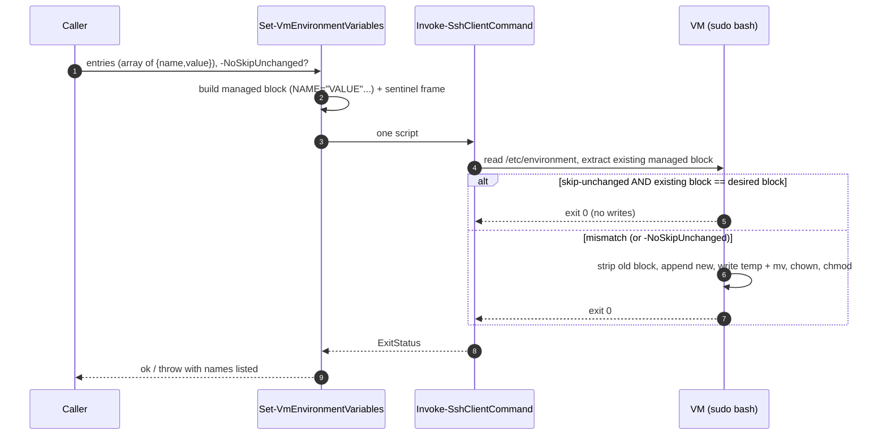
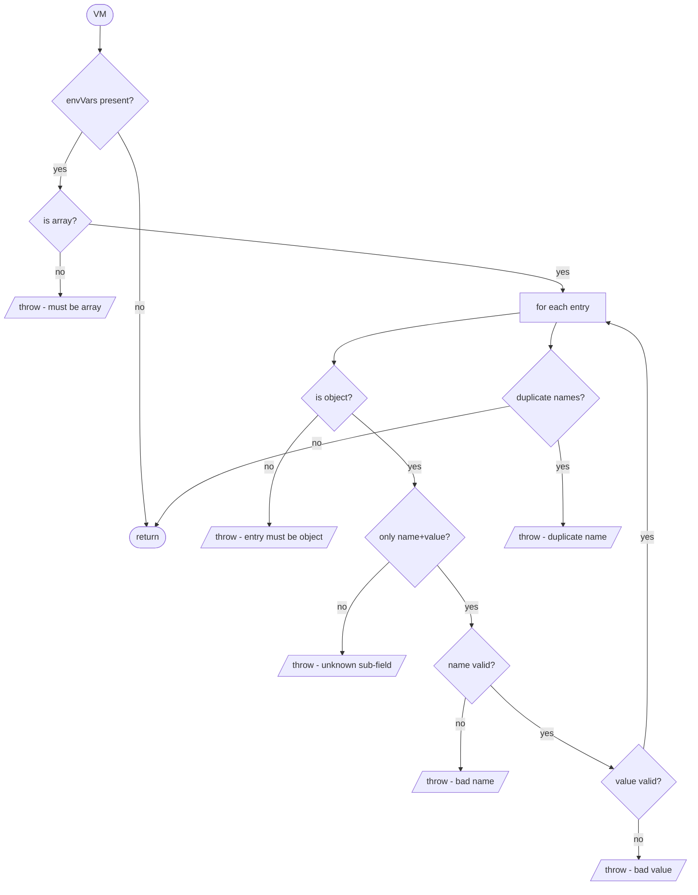
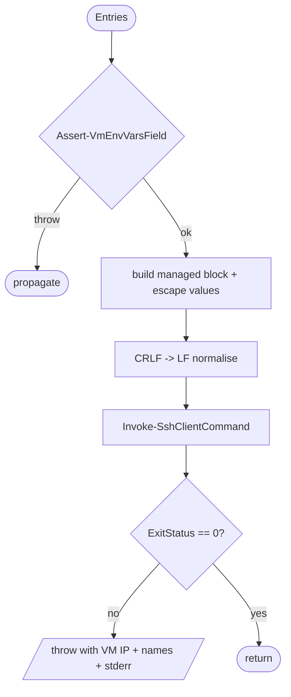
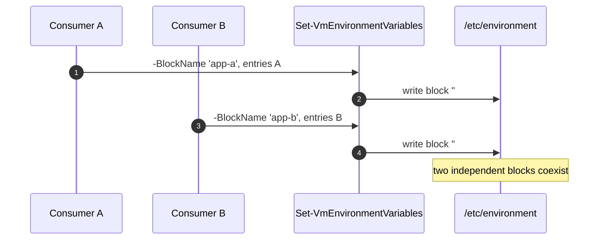
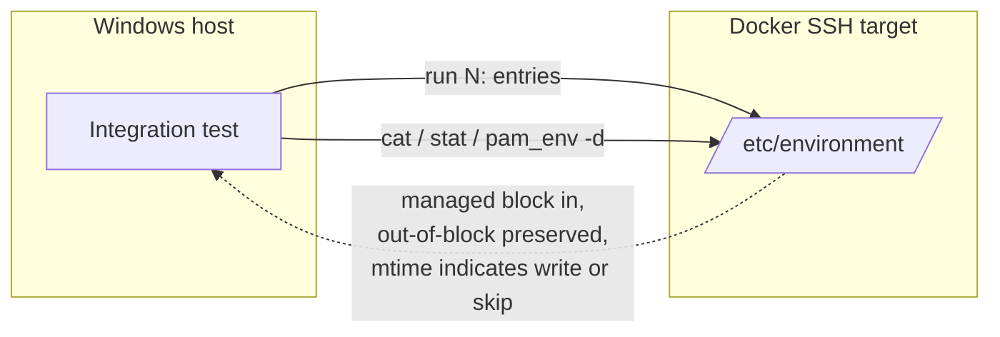

# Plan: Writing system-wide environment variables on a VM

See [problem.md](problem.md) for context, scope, design decisions
and acceptance criteria. This plan turns those decisions into the
smallest committable steps that each carry their own tests.

## Index

- [Shape of the change](#shape-of-the-change)
- [Step 1: Schema validator `Assert-VmEnvVarsField`](#step-1-schema-validator-assert-vmenvvarsfield)
- [Step 2: Transport `Set-VmEnvironmentVariables`](#step-2-transport-set-vmenvironmentvariables)
- [Step 3: Per-VM `blockName` (schema + transport)](#step-3-per-vm-blockname-schema--transport)
- [Step 4: Integration tests against the Docker target](#step-4-integration-tests-against-the-docker-target)

Each step that adds a new public function also ships it: it edits the
psm1 (`Export-ModuleMember`), the psd1 (`FunctionsToExport` plus a
`ModuleVersion` bump), and the README in the same commit so the
release-triggering version always lands together with the surface
that justifies it. Step 3 adds no public surface and therefore no
manifest / version change.

## Shape of the change

Two new public functions in `Infrastructure.HyperV`, sitting
alongside the existing file-transfer primitives. The validator
mirrors
[Assert-VmFilesField](../../../../Infrastructure.HyperV/Public/FileTransfer/Assert-VmFilesField.ps1)'s
"shared rules, consumer opts in" pattern; the transport mirrors
[Copy-VmFiles](../../../../Infrastructure.HyperV/Public/FileTransfer/Copy-VmFiles.ps1)'s
"single SSH round-trip, skip-unchanged on by default" shape.



## Step 1: Schema validator `Assert-VmEnvVarsField`

**Reason.** Schema rules are the cheapest layer to fail in - a typo
in the JSON should never reach SSH. Landing the validator first
also lets Step 2's transport tests construct its inputs by
calling the validated path, not by hand-rolled fixtures that
could drift from the real rules. Same shape as
[01 - bulk-vm-file-transfer Step 4](../01%20-%20bulk-vm-file-transfer/plan.md)
chose for `Assert-VmFilesField`'s `-AllowBulkEntries` switch:
the validator owns the rules, consumers opt in by calling it.

**Files.**

- New: `Infrastructure.HyperV/Public/EnvVars/Assert-VmEnvVarsField.ps1`
- New: `Tests/Assert-VmEnvVarsField.Tests.ps1`
- Edit: `Infrastructure.HyperV/Infrastructure.HyperV.psm1`
  (`Export-ModuleMember -Function 'Assert-VmEnvVarsField'`; dot-source
  the new file via whatever per-folder loader pattern the psm1 already
  uses).
- Edit: `Infrastructure.HyperV/Infrastructure.HyperV.psd1`
  (`FunctionsToExport += 'Assert-VmEnvVarsField'`; bump
  `ModuleVersion` from `0.6.0` to `0.7.0` - additive public surface,
  minor bump).
- Edit: `README.md` - new row for `Assert-VmEnvVarsField` next to
  `Assert-VmFilesField` so the validator pair stays visually grouped;
  bump the `Install-Module -MinimumVersion` line to `0.7.0`.

**Behaviour.**

- Signature: `Assert-VmEnvVarsField -Vm $vm`. No extra knobs in
  v1 - the rule set is fixed (see
  [problem.md - Design decisions](problem.md#design-decisions)).
- `envVars` may be absent: returns silently. Consumers gate the
  call themselves if presence is significant to them; the
  validator is a no-op when the field is missing, matching
  `Assert-VmFilesField`'s shape.
- When present, must be a JSON array (PSCustomObject or string
  is rejected with a message naming the VM).
- Each entry must be a `PSCustomObject` with exactly the
  allowed sub-fields `name` and `value` (unknown sub-fields
  throw with the offending key named).
- `name`: required string, matches `^[A-Za-z_][A-Za-z0-9_]*$`,
  must not contain `=`. Throws naming the entry index and the
  observed value on any failure.
- `value`: required string, non-empty, no `\n`, no `\r`, no
  `\0`. Throws naming the entry index and which character class
  was violated.
- Duplicate `name` across entries is a schema error (two
  conflicting writes to the same key would mask the operator's
  intent). The duplicate detection runs after per-entry shape
  checks so a malformed entry surfaces first.

**Tests (unit).** No mocks needed - the validator is a pure
function over the parsed VM object.

- `envVars` absent: returns silently.
- Empty array: returns silently (the transport handles the
  "remove the whole block" semantic; an empty list is a valid
  intent, not a schema error).
- Valid single entry: returns silently.
- Multiple valid entries: returns silently.
- `envVars` is a string / object / `$null`: throws with VM name
  and "must be an array".
- Entry that is not an object: throws with entry index.
- Missing `name` / missing `value`: throws naming the field.
- Unknown sub-field (e.g. `default`, `append`): throws naming
  the key.
- `name` violating identifier regex (digits-first, dash,
  whitespace, empty string, `=`): one case per shape, each
  throws with the observed value quoted.
- `value` empty / contains `\n` / contains `\r` / contains
  `\0`: one case per shape.
- Two entries with the same `name`: throws naming the duplicate.

**Mermaid.**



**README.** This step IS the validator's README row + the `0.7.0`
`Install-Module` bump. No prose elsewhere needs changing yet -
the transport row lands in Step 2.

**Module parity check.** The shared `Module.Tests.ps1` in the
run-unit-tests action enforces that `FunctionsToExport` in the psd1
matches the `Export-ModuleMember` set in the psm1; missing either
side fails the build, so no separate test is needed for the wiring.

## Step 2: Transport `Set-VmEnvironmentVariables`

**Reason.** Lands the actual write path. Lives in its own file
under the existing `Public/` layout so the module's organisation
keeps grouping by concern (file transfer in `FileTransfer/`,
SSH in `Ssh/`, file server in `FileServer/`, env vars in
`EnvVars/`). The whole script - reconcile + strip + append +
atomic write + chown + chmod - is one remote command, matching
the round-trip discipline of
[02 - skip-unchanged Step 1](../02%20-%20skip-unchanged-on-copy/plan.md#step-1-reconcile-or-write-in-copy-vmfiles---noskipunchanged).

**Files.**

- New: `Infrastructure.HyperV/Public/EnvVars/Set-VmEnvironmentVariables.ps1`
- New: `Tests/Set-VmEnvironmentVariables.Tests.ps1`
- Edit: `Infrastructure.HyperV/Infrastructure.HyperV.psm1`
  (`Export-ModuleMember -Function 'Set-VmEnvironmentVariables'`;
  dot-source the new file alongside the validator from Step 1).
- Edit: `Infrastructure.HyperV/Infrastructure.HyperV.psd1`
  (`FunctionsToExport += 'Set-VmEnvironmentVariables'`; bump
  `ModuleVersion` from `0.7.0` to `0.8.0` - additive public surface,
  minor bump).
- Edit: `README.md` - new row for `Set-VmEnvironmentVariables` next
  to `Copy-VmFiles` so the transport primitives stay visually
  grouped; bump the `Install-Module -MinimumVersion` line to `0.8.0`.

**Behaviour.**

- Signature:
  ```
  Set-VmEnvironmentVariables
      -SshClient        <SshClient>           # connected, caller-owned
      -Entries          <object[]>            # 0..N {name,value}; empty removes the block
      [-NoSkipUnchanged]                      # force a write even on a match
  ```
- Host-side, per call:
  1. Validate entries by calling
     `Assert-VmEnvVarsField` on a synthetic
     `[PSCustomObject]@{ envVars = $Entries }` so the rule set
     is the single source of truth (no duplicated regex). When
     `$Entries.Count -eq 0`, skip the synthetic object and
     proceed directly to the "remove block" branch.
  2. Build the desired managed block as a string:
     ```
     # BEGIN Infrastructure.HyperV envVars
     NAME1="VAL1"
     NAME2="VAL2"
     # END Infrastructure.HyperV envVars
     ```
     with each value escaped: `\` -> `\\`, `"` -> `\"`. Order
     follows the entries array (preserves operator intent and
     keeps diffs minimal across runs).
  3. Build one remote script (see "Remote script shape" below).
     Apply the same CRLF -> LF normalisation
     [Copy-VmFiles](../../../../Infrastructure.HyperV/Public/FileTransfer/Copy-VmFiles.ps1)
     uses before sending (matches the saved feedback on
     PowerShell here-string line endings tripping bash).
  4. Invoke via `Invoke-SshClientCommand`. On non-zero
     `ExitStatus`, throw with the VM IP, the list of `name`
     values being written, and the captured stderr - same
     diagnostic shape as `Copy-VmFiles`.

**Remote script shape.** Single `sudo bash -s` invocation under
`set -euo pipefail`. The script:

- Reads `/etc/environment` if present, treats missing as empty.
- Extracts the existing managed block by line range between the
  sentinel markers (using `awk` keyed on the exact marker text
  so a stray `# BEGIN ...` in operator content cannot match).
- When skip-unchanged is on (the default), compares the
  extracted block (excluding markers) with the desired block
  (excluding markers). On byte-equal match, `exit 0` before
  any write.
- Otherwise: strips the existing block (markers + content) from
  the file body, appends the new block, writes the result to
  `/etc/environment.tmp.<pid>`, `chown root:root` + `chmod 0644`
  the temp file, then `mv` it over `/etc/environment` (atomic
  on the same filesystem - the directory entry rename is the
  point of consistency).
- When `Entries.Count -eq 0`: the new block is empty (no markers
  emitted), so the result is the original file with the managed
  block stripped. Same atomic-write path.
- The whole script is single-quoted on the bash command line and
  values are interpolated host-side into the script body, so a
  malicious VALUE cannot break out into shell parsing. Values
  themselves are written quoted with `"..."` so `pam_env` parses
  them as literals.

**Tests (unit).** Mock `Invoke-SshClientCommand` and capture the
`-Command` string; assert on its shape. No live SSH.

- Default path emits a script containing:
  - `set -euo pipefail`
  - the exact BEGIN / END sentinel strings
  - one `NAME="VALUE"` line per entry, in order, with values
    correctly escaped (test against entries containing `"` and
    `\` to lock the escape sequences)
  - the reconcile block (block-extract + byte-equality + early
    `exit 0`)
  - the atomic-write trio (write to temp, chown, chmod, then
    `mv` over the target)
- `-NoSkipUnchanged`: emitted script does NOT contain the
  reconcile block.
- Empty entries array: emitted script contains the strip-block
  branch and no `BEGIN` / `END` literals in the desired block.
- Validator failure (e.g. duplicate `name`) throws **before**
  `Invoke-SshClientCommand` is called (assert with mock
  `Should -Not -Invoke`).
- Non-zero `ExitStatus` from the SSH mock causes
  `Set-VmEnvironmentVariables` to throw with the VM IP, the
  names list, and the mocked stderr in the message.
- CRLF -> LF normalisation: emitted command contains no `\r`
  bytes (asserted with a length / contains check, same as
  `Copy-VmFiles.Tests.ps1` does today).
- Two entries with the same `name` short-circuits at the
  validator and never reaches the SSH mock.

**Mermaid.**



**README.** This step IS the transport's README row + the `0.8.0`
`Install-Module` bump. Same parity guard from Step 1 applies.

## Step 3: Per-VM `blockName` (schema + transport)

**Reason.** A single hard-coded sentinel
(`Infrastructure.HyperV envVars`) means any two consumers wiring
this transport into the same VM (e.g. a CI repo and a separate
service-config repo) would collide on the same managed block - the
"last writer wins, everyone else's keys disappear" failure mode.
Naming the block per VM in the JSON lets unrelated owners coexist
in one `/etc/environment`. Required (no implicit default) so a
collision can never happen by accident; see
[problem.md - Design decisions](problem.md#design-decisions).

This step is split across the validator AND the transport in one
commit because the two halves are useless apart: the validator
would accept a field the transport ignored, or the transport would
demand a parameter the validator did not enforce.

**Files.**

- Edit: `Infrastructure.HyperV/Public/EnvVars/Assert-VmEnvVarsField.ps1`
  - Treat `envVars` as a JSON object (PSCustomObject) `{ blockName, entries }`
    rather than an array. Both sub-fields are required.
  - Replace the existing "must be a JSON array" check with the new
    object-shape check; the existing per-entry rules move under
    `envVars.entries` unchanged.
- Edit: `Infrastructure.HyperV/Public/EnvVars/Set-VmEnvironmentVariables.ps1`
  - Add a `-BlockName` parameter (`Mandatory`, validated by a
    private helper that mirrors the validator's `blockName` rules
    so the transport stays safe even when callers bypass the
    JSON-side validator).
  - Replace the literal `# BEGIN Infrastructure.HyperV envVars` /
    `# END ...` strings in the emitted script with markers built
    from `$BlockName`, embedded host-side into the same bash
    variable assignments (`BEGIN_MARKER='# BEGIN <name>'`).
- Edit: `Tests/Assert-VmEnvVarsField.Tests.ps1` - rewrap every
  fixture so `envVars` is `{ blockName, entries: [...] }`; add new
  cases for the `blockName` rules (missing / wrong type / empty /
  too long / forbidden character / leading-trailing whitespace);
  add a case asserting both fields are required.
- Edit: `Tests/Set-VmEnvironmentVariables.Tests.ps1` - add
  `-BlockName 'test-block'` to every existing call; add a new test
  asserting the emitted script contains the supplied name in BOTH
  marker assignments; add a test asserting two different
  `-BlockName` values produce two scripts whose marker strings
  differ.
- Edit: `Infrastructure.HyperV/Infrastructure.HyperV.psd1` - bump
  `ModuleVersion` from `0.8.0` to `0.9.0` (breaking schema change
  on the validator's input shape; pre-1.0 minor bump per semver).
- Edit: `README.md` - update the `Assert-VmEnvVarsField` row to
  describe the new wrapper shape and the `blockName` rules; update
  the `Set-VmEnvironmentVariables` row to mention the required
  `-BlockName` parameter; bump the `Install-Module -MinimumVersion`
  line to `0.9.0`.

**Behaviour.**

- `Assert-VmEnvVarsField`:
  - `envVars` absent: still a silent return (consumers gate the
    call themselves).
  - When present: must be a `PSCustomObject` with exactly the
    sub-fields `blockName` and `entries`. Array / string / unknown
    sub-fields throw.
  - `blockName`: required string, 1-128 chars, matches
    `^[A-Za-z0-9._ -]+$`, must not start or end with whitespace.
    Throws naming the offending value on any failure.
  - `entries`: required array, may be empty (the transport treats
    empty as "remove the block"). Existing per-entry rules apply
    unchanged; the duplicate-name pass also runs unchanged.
- `Set-VmEnvironmentVariables`:
  - `-BlockName` is `Mandatory`; the parameter binder rejects
    missing values before any function-body code runs.
  - A private host-side check re-runs the same `blockName` rules
    so a caller that did not go through `Assert-VmEnvVarsField`
    cannot inject `'` or newlines into the marker line.
  - The emitted script uses `$BlockName` in both marker assignments
    and nowhere else; the awk / strip / atomic-write logic is
    untouched.

**Tests (unit).**

Validator:

- `envVars` is a `PSCustomObject` with both `blockName` and
  `entries`: returns silently for valid shapes.
- `envVars` is an array (old shape) or a string: throws with
  "must be an object with blockName and entries".
- `envVars` missing `blockName` / missing `entries`: throws
  naming the missing field.
- `envVars` with an unknown sub-field (e.g. `name`, `markerVersion`):
  throws naming the key.
- `blockName` not a string / empty / longer than 128 / containing
  `'` / containing `\n` / containing `\r` / containing `\0` /
  containing a leading or trailing space: one `It` per shape, each
  asserts the offending value appears in the message.
- All existing entry-shape tests are migrated, not deleted - they
  now construct their `envVars` via the new wrapper. Same
  coverage, same expected errors.

Transport:

- Calling without `-BlockName` is a parameter-binding error
  (Pester `Should -Throw` against the binder message).
- `-BlockName 'app-a'` makes BOTH marker assignments contain
  `'# BEGIN app-a'` and `'# END app-a'`.
- Two calls with `-BlockName 'app-a'` and `-BlockName 'app-b'`
  produce two scripts whose marker assignments differ - locks in
  the "use the parameter, not a constant" wiring.
- A `-BlockName` containing a `'` is rejected host-side, before
  the SSH mock is called (`Should -Not -Invoke`). The validator
  would already catch JSON-sourced names; this guards the
  transport against direct callers.
- All existing tests gain an explicit `-BlockName` argument; the
  reconcile / atomic-write / escape / empty-entries / SSH-failure
  assertions continue to hold.

**Mermaid.**



**README.** Update the `Assert-VmEnvVarsField` and
`Set-VmEnvironmentVariables` rows in place; bump
`Install-Module -MinimumVersion` to `0.9.0`. No new rows.

## Step 4: Integration tests against the Docker target

**Reason.** Unit tests pin the script shape; only a live VM-side
run can prove the awk extraction, the atomic `mv`, the
out-of-block preservation, and the per-`blockName` isolation from
Step 3 behave as intended. Mirrors the integration split used by
[01 - bulk-vm-file-transfer Step 3](../01%20-%20bulk-vm-file-transfer/plan.md#step-3-integration-tests-against-the-docker-target)
and
[02 - skip-unchanged Step 2](../02%20-%20skip-unchanged-on-copy/plan.md#step-2-integration-tests-against-the-docker-target).
The Docker SSH target already provides sudo, an Ubuntu
`/etc/environment`, and the `Invoke-SshClientCommand` helper used
for verification.

**Files.**

- New: `Tests/Integration.DockerTarget/Set-VmEnvironmentVariables.Tests.ps1`

**Scenarios** (each a separate `It`). All verification uses
`Invoke-SshClientCommand` to read back the file and run
small checks; mtime acts as the "did the write run" proxy
(same idea as the skip-unchanged tests).

1. **First-run create.** Empty target file (or pre-seeded with
   only Ubuntu's `PATH=...`). Call with two entries
   (`FOO_HOME=/opt/foo`, `BAR_OPTS=-Xmx512m`). Verify: the
   BEGIN / END markers exist, the two lines sit between them,
   ownership is `root:root`, mode is `0644`, and any
   pre-existing `PATH=...` line is still present unchanged.
2. **Idempotent re-run.** Repeat (1) with the exact same entries
   and skip-unchanged on (the default). Verify: file mtime is
   unchanged from the snapshot taken after (1), file contents
   are byte-identical.
3. **`-NoSkipUnchanged` forces a write.** Repeat (1) with the
   exact same entries and `-NoSkipUnchanged`. Verify: file
   mtime advances; contents are still byte-identical.
4. **Add a key.** Re-run with three entries (the two from (1)
   plus `BAZ_DIR=/var/cache/baz`). Verify: managed block now
   contains three lines in the given order; lines outside the
   markers are still present unchanged.
5. **Remove a key.** Re-run with only `FOO_HOME`. Verify:
   managed block contains exactly that line; `BAR_OPTS` and
   `BAZ_DIR` are gone from the file entirely (not commented
   out, not present outside the block); out-of-block lines
   preserved.
6. **Drift outside the block is preserved.** Manually append a
   line *after* the END marker (e.g.
   `echo 'LANG="en_US.UTF-8"' | sudo tee -a /etc/environment`).
   Re-run with the (5) entries. Verify: the manually-added line
   is still present after the call.
7. **Drift inside the block is reverted.** Manually edit one
   line inside the managed block via sudo. Re-run with the (5)
   entries and skip-unchanged on. Verify: the line is back to
   the desired value (reconcile sees a content mismatch and
   re-writes), the manually-added line from (6) is still
   present.
8. **Empty entries removes the block.** Call with `@()`.
   Verify: BEGIN / END markers are gone, no managed lines
   remain, every out-of-block line (Ubuntu's `PATH=...`, the
   manually-added `LANG=...`) is still present and unchanged.
9. **Re-create after removal.** Call again with one entry.
   Verify: a fresh block appears at the end of the file with
   the correct markers and the one line.
10. **Values with special characters round-trip.** Call with an
    entry whose value contains `"`, `\`, and a space.
    Verify the line written to disk has the value correctly
    quoted and escaped, and that `bash -lc 'echo "$NAME"'`
    after a fresh login (or `pam_env -d`) yields the original
    string.
11. **Two block names coexist.** Call with
    `-BlockName 'integration-a'` and entries A, then call with
    `-BlockName 'integration-b'` and entries B. Verify: both
    blocks are present in `/etc/environment`, each with its own
    BEGIN / END markers, and the lines of one block do not
    appear inside the other. A re-run of (A) with the same
    entries does not disturb (B). A call with empty entries on
    `-BlockName 'integration-a'` removes that block only;
    `-BlockName 'integration-b'`'s block is preserved
    byte-for-byte. Pins the per-VM `blockName` contract
    introduced in Step 3.

**Tests (unit).** None - this step adds only integration tests.

**Mermaid.**



**README.** No edit in this step - all consumer-visible surface
shipped with Steps 1 and 2.
