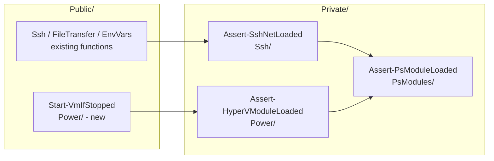
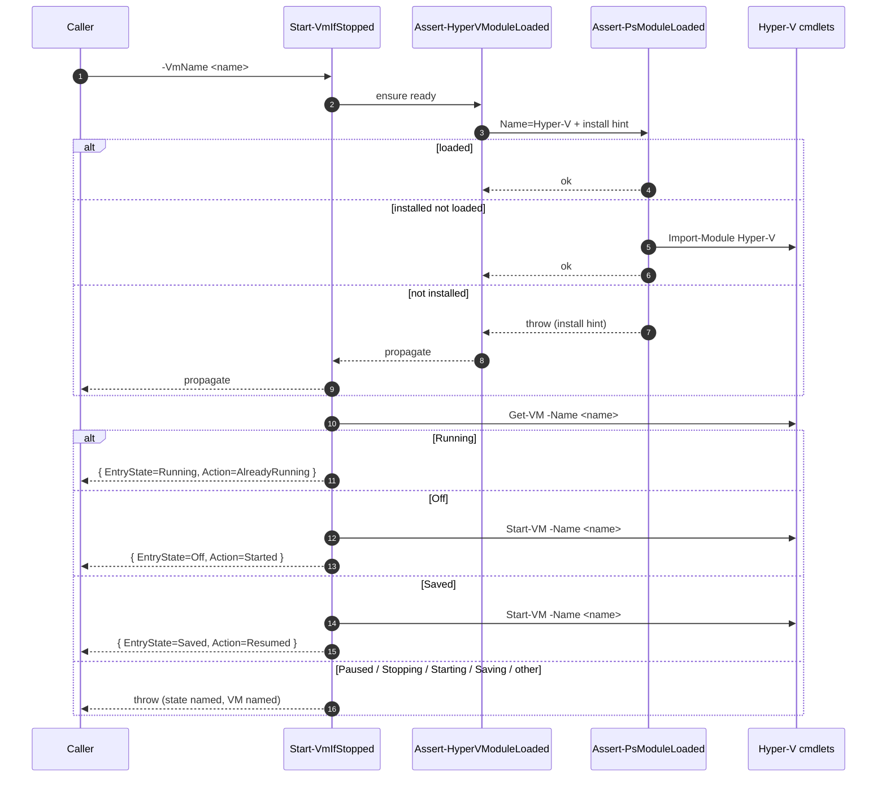
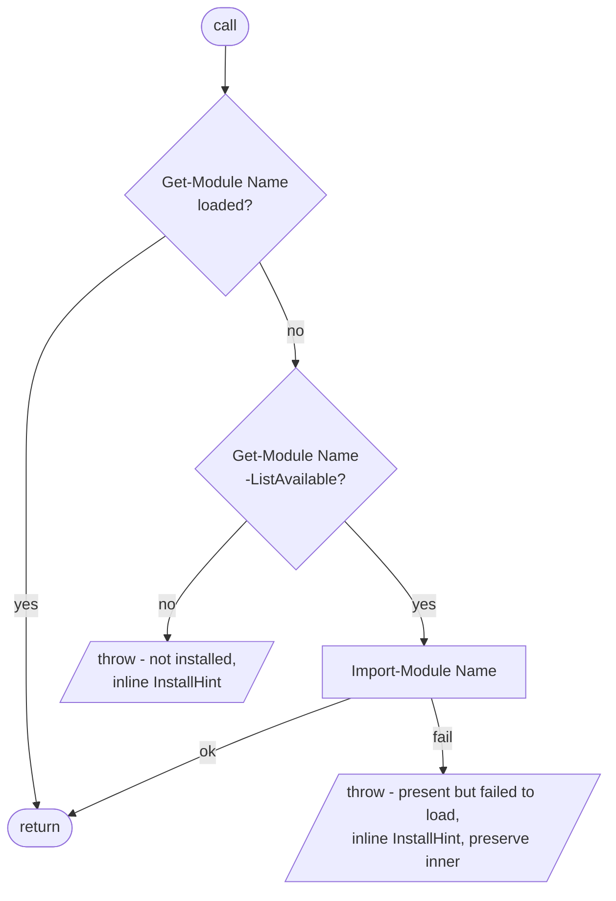
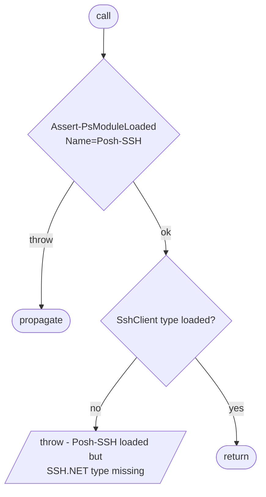
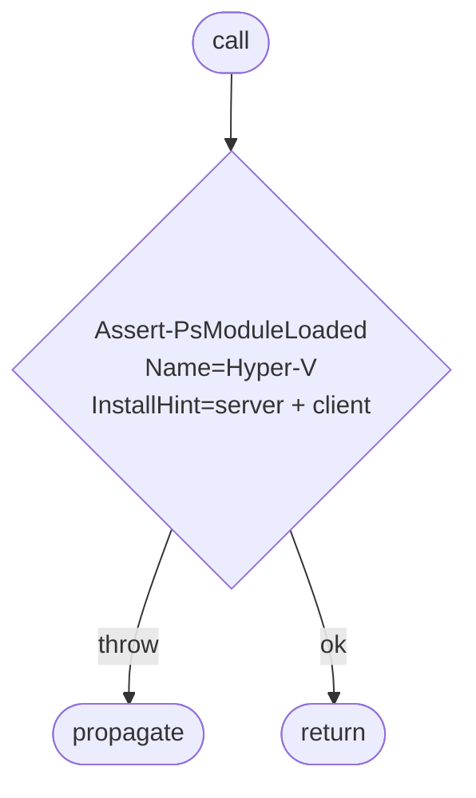
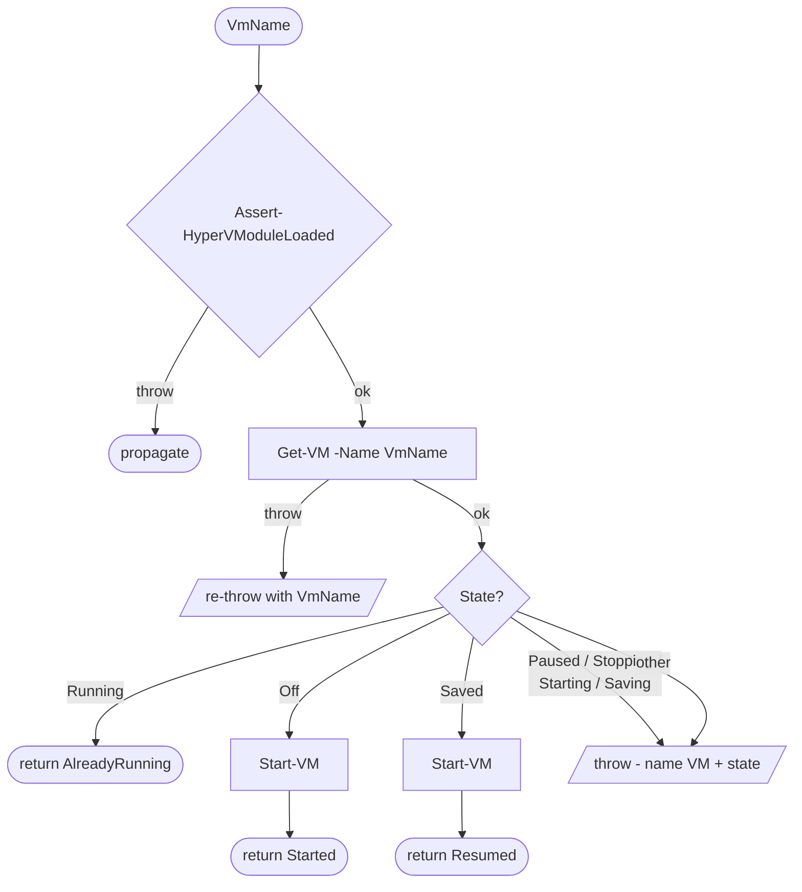

# Plan: Starting a Hyper-V VM idempotently

See [problem.md](problem.md) for context, scope, design decisions
and acceptance criteria. This plan turns those decisions into the
smallest committable steps that each carry their own tests.

## Index

- [Shape of the change](#shape-of-the-change)
- [Step 1: Shared private helper `Assert-PsModuleLoaded`](#step-1-shared-private-helper-assert-psmoduleloaded)
- [Step 2: Refactor `Assert-SshNetLoaded` onto the shared helper](#step-2-refactor-assert-sshnetloaded-onto-the-shared-helper)
- [Step 3: Private guard `Assert-HyperVModuleLoaded`](#step-3-private-guard-assert-hypervmoduleloaded)
- [Step 4: Public `Start-VmIfStopped`](#step-4-public-start-vmifstopped)

Each step that adds a new public function also ships it: it edits
the psm1 (`Export-ModuleMember`), the psd1 (`FunctionsToExport`
plus a `ModuleVersion` bump), and the README in the same commit so
the release-triggering version always lands together with the
surface that justifies it. Steps 1-3 add only private helpers and
therefore no manifest / version change.

## Shape of the change

A shared "ensure a PowerShell module is loaded, or throw with an
install hint" primitive lives in
`Private/PsModules/Assert-PsModuleLoaded.ps1`. Both the existing SSH
guard ([Assert-SshNetLoaded](../../../../Infrastructure.HyperV/Private/Ssh/Assert-SshNetLoaded.ps1))
and the new Hyper-V guard delegate to it, so the
"loaded? available? install hint?" cascade lives in one place and
any future module-prerequisite guard reuses the same diagnostic
shape. One new public function (`Start-VmIfStopped`) under
`Public/Power/` sits on top of the Hyper-V guard.





## Step 1: Shared private helper `Assert-PsModuleLoaded`

**Reason.** The existing `Assert-SshNetLoaded` relies on the
caller importing Posh-SSH first - a host where Posh-SSH is
installed but auto-loading is off
(`$PSModuleAutoloadingPreference = 'None'`) fails the type check
and gets a misleading "install Posh-SSH" message. The new Hyper-V
guard needs the same loaded? -> available? -> install cascade.
Landing the shared primitive first means Steps 2 and 3 are pure
delegations rather than two parallel re-implementations that
would drift apart in maintenance.

No public surface, so no manifest / version bump.

**Files.**

- New: `Infrastructure.HyperV/Private/PsModules/Assert-PsModuleLoaded.ps1`
- New: `Tests/Assert-PsModuleLoaded.Tests.ps1`
- Edit: `Infrastructure.HyperV/Infrastructure.HyperV.psm1`
  - Dot-source the new file under a new `# Private/PsModules/`
    grouping at the top of the Private block (before
    `Private/FileServer/`), so callers further down can rely on
    it being defined.
  - Update the header comment's "Private helpers" paragraph to
    mention the `PsModules/` folder and `Assert-PsModuleLoaded`.

**Behaviour.**

- Signature:
  ```
  Assert-PsModuleLoaded
      -Name        <string>   # Mandatory, non-empty - PS module name
      -InstallHint <string>   # Mandatory, non-empty - inlined into the
                              # "not installed" error so each consumer
                              # supplies its own SKU-appropriate guidance
  ```
- Three-step cascade, in order:
  1. **Already loaded?** `Get-Module -Name $Name` (no
     `-ListAvailable`). Non-null -> return silently. No
     `Import-Module` side effect on the happy path.
  2. **Installed but not loaded?** `Get-Module -Name $Name
     -ListAvailable`. Non-null -> `Import-Module -Name $Name
     -ErrorAction Stop`, then return. Covers the auto-loading-off
     and never-imported cases that a `Get-Command` probe would
     misdiagnose.
  3. **Not installed.** Throw a single message of the shape
     `"Required PowerShell module '<name>' is not installed.
     <InstallHint>"`.
- An `Import-Module` failure in step 2 is wrapped with a distinct
  `"PowerShell module '<name>' is present but failed to load.
  <InstallHint>"` message, preserving the original exception as
  `InnerException`, so the operator does not chase the wrong fix
  for a half-installed feature.
- No state, no global side effects beyond the conditional
  `Import-Module` in step 2 (which is the intended effect - the
  caller needs the module in scope).

Why not `Get-Command <cmdletName>`: false negative when
auto-loading is disabled; false positive when an unrelated module
exports a function of the same name (e.g. VMware PowerCLI's
`Get-VM` colliding with the Hyper-V cmdlet). Asking the module
system about the module by name avoids both failure modes.

**Tests (unit).** Mock `Get-Module` and `Import-Module`.

- Already loaded (loaded check returns a `PSModuleInfo`-shaped
  object): returns silently; `Get-Module -ListAvailable` is NOT
  called; `Import-Module` is NOT called.
- Installed but not loaded (loaded check returns `$null`,
  available check returns a module info): returns silently;
  `Import-Module -Name <Name>` is invoked exactly once.
- Not installed (both checks return `$null`): throws; message
  contains the supplied `-Name` and the supplied `-InstallHint`
  verbatim; `Import-Module` is NOT called.
- `Import-Module` failure: throws the dedicated "present but
  failed to load" wrapper; message contains `-Name` and
  `-InstallHint`; inner exception is preserved on
  `InnerException` and surfaces in the formatted message.
- All `Get-Module` and `Import-Module` mocks are filtered on
  `-Name` so the helper cannot inspect or import a module other
  than the one requested.
- Missing / empty `-Name` and missing / empty `-InstallHint` are
  parameter-binding errors (one `It` per shape).

**Mermaid.**



**README.** No edit - private helper, not part of the
consumer-visible surface.

## Step 2: Refactor `Assert-SshNetLoaded` onto the shared helper

**Reason.** Brings the SSH guard up to the same loaded? ->
available? -> install standard introduced in Step 1, and locks
the two guards onto a single source of truth so a future fix to
the cascade lands in one place. Landed as its own step so the
diff is reviewable in isolation: an SSH consumer breaking after
this commit can be bisected to the refactor without dragging
Steps 3-4 into the investigation.

Pre-1.0 internal refactor, no public-surface change, no manifest
/ version bump.

**Files.**

- Edit: `Infrastructure.HyperV/Private/Ssh/Assert-SshNetLoaded.ps1`
  - Replace the bare `'Renci.SshNet.SshClient' -as [type]` check
    with a `Assert-PsModuleLoaded -Name 'Posh-SSH' -InstallHint
    '<existing wording>'` call.
  - After the helper returns, keep a final
    `'Renci.SshNet.SshClient' -as [type]` sanity check that
    throws if the type is still absent. Posh-SSH bundles
    `Renci.SshNet.dll` and loads it on import, so the sanity
    check is a belt-and-braces guard against a future Posh-SSH
    restructure breaking this assumption silently; the message
    explicitly names the type so a regression is unambiguous.
  - Update the file header comment block to reflect the
    delegation (the rationale paragraph about "future change to
    the prerequisite" now points at `Assert-PsModuleLoaded`).
- Edit: `Tests/Assert-SshNetLoaded.Tests.ps1`
  - Replace the single "not loaded" test with mocked-helper
    coverage. The four shapes mirror Step 1's matrix but seen
    from the SSH guard's perspective: helper returns silently +
    type present (returns), helper returns silently + type still
    absent (throws naming the type), helper throws "not
    installed" (propagates), helper throws "present but failed
    to load" (propagates).
  - The Posh-SSH install hint string is asserted to be the same
    operator-facing text that the file originally produced, so
    the diagnostic an operator sees on a fresh host is unchanged
    by this refactor.

**Behaviour.**

- Public contract is unchanged from the consumer's perspective:
  a fresh host without Posh-SSH still gets an actionable error
  pointing at the install path; a host with Posh-SSH loaded
  still passes silently.
- New, previously-broken case now works: a host with Posh-SSH
  installed but not imported (auto-loading off or just never
  touched) now succeeds, with `Posh-SSH` imported as a
  documented side effect.
- The type-sanity check after import means a future Posh-SSH
  release that loads cleanly but no longer bundles
  `Renci.SshNet.dll` (or namespaces it differently) fails loud
  rather than silent at the first SSH call.

**Tests (unit).** Mock `Assert-PsModuleLoaded`; do NOT mock
`-as [type]` (it is a language operator).

- Helper returns + type present: returns silently. Asserted in
  the existing-CI environment by spy-importing a stub `Posh-SSH`
  fixture that defines the type, OR by skipping the assertion
  branch with a `-Skip` guard when the type is absent and
  covering it only on hosts where Posh-SSH is real - whichever
  the existing CI matrix supports without new infra (mirror the
  pattern the integration tests already use).
- Helper returns + type absent: throws with a message naming
  `Renci.SshNet.SshClient` and pointing at the "Posh-SSH
  installed but DLL missing" failure mode.
- Helper throws (not installed): the SSH guard propagates the
  original exception without wrapping (callers see the helper's
  install-hint message, not a doubly-nested one).
- Helper throws (import failed): same propagation, original
  `InnerException` preserved.

**Mermaid.**



**README.** No edit - private helper, no public-surface change.

## Step 3: Private guard `Assert-HyperVModuleLoaded`

**Reason.** Adds the Hyper-V-side guard that Step 4 consumes,
delegating its full cascade to the shared helper landed in Step
1. Lands as a separate step (rather than inside Step 4) so the
test surface is reviewable in isolation - the public function in
Step 4 then only needs to verify "the guard is called before any
Hyper-V cmdlet", not the cascade itself.

No public surface, no manifest / version bump.

**Files.**

- New: `Infrastructure.HyperV/Private/Power/Assert-HyperVModuleLoaded.ps1`
- New: `Tests/Assert-HyperVModuleLoaded.Tests.ps1`
- Edit: `Infrastructure.HyperV/Infrastructure.HyperV.psm1`
  - Dot-source the new file under a new `# Private/Power/`
    grouping that mirrors the existing per-folder grouping.
  - Update the header comment's "Private helpers" list to
    include `Assert-HyperVModuleLoaded`.

**Behaviour.**

- Signature: `Assert-HyperVModuleLoaded` (no parameters).
- Body: one call to `Assert-PsModuleLoaded -Name 'Hyper-V'
  -InstallHint <hint>` and nothing else. The install hint string
  lives inline in this file (single source of truth for the
  Hyper-V wording) and names both SKUs:
  `Install-WindowsFeature Hyper-V-PowerShell` (server) /
  `Enable-WindowsOptionalFeature -Online -FeatureName
  Microsoft-Hyper-V-Management-PowerShell` (client).
- On success returns silently. The shared helper handles the
  conditional `Import-Module Hyper-V` side effect.

**Tests (unit).** Mock `Assert-PsModuleLoaded`.

- Happy path (helper returns silently): the guard returns
  silently.
- Helper invoked exactly once with `-Name 'Hyper-V'` and an
  `-InstallHint` containing both `Install-WindowsFeature
  Hyper-V-PowerShell` and `Enable-WindowsOptionalFeature` -
  asserted via `ParameterFilter` so a future edit that drops
  either SKU's hint fails the test.
- Helper throws (not installed): the guard propagates without
  wrapping; the operator-facing message is the helper's, not a
  doubly-nested wrapper.
- Helper throws (present but failed to load): same propagation,
  original `InnerException` preserved.
- No direct call to `Get-Module` / `Import-Module` from this
  guard (asserted via `Should -Not -Invoke`) - locks the
  delegation in so a future contributor cannot quietly bypass
  the shared helper.

**Mermaid.**



**README.** No edit - private helper.

## Step 4: Public `Start-VmIfStopped`

**Reason.** Lands the public surface and the full state machine
described in
[problem.md - Acceptance criteria](problem.md#acceptance-criteria).
Lives in its own file under a new `Public/Power/` folder so the
module keeps grouping by concern (`Ssh/`, `FileServer/`,
`FileTransfer/`, `EnvVars/`, now `Power/`). The state machine is
small and side-effect-free outside the `Start-VM` call, so a
single commit covers both the implementation and its tests.

**Files.**

- New: `Infrastructure.HyperV/Public/Power/Start-VmIfStopped.ps1`
- New: `Tests/Start-VmIfStopped.Tests.ps1`
- Edit: `Infrastructure.HyperV/Infrastructure.HyperV.psm1`
  - Dot-source the new file under a new `# Public/Power/`
    grouping that mirrors the existing per-folder grouping.
  - Add `'Start-VmIfStopped'` to the `Export-ModuleMember
    -Function` array, keeping the array alphabetised (slots
    between `Set-VmEnvironmentVariables` and `Test-VmSshPort`).
  - Update the header comment's "Current functions" list with a
    `Start-VmIfStopped` row and add `Power\` to the per-folder
    grouping legend.
- Edit: `Infrastructure.HyperV/Infrastructure.HyperV.psd1`
  - Add `'Start-VmIfStopped'` to `FunctionsToExport`,
    alphabetised.
  - Bump `ModuleVersion` from `0.7.0` to `0.8.0` (additive
    public surface, pre-1.0 minor bump).
- Edit: `README.md`
  - Add a row for `Start-VmIfStopped` next to `Wait-VmSshReady`
    so "power on" and "wait for reachability" sit visually
    adjacent (matches how composing them is the expected usage).
  - Bump the `Install-Module -MinimumVersion` line to `0.8.0`.

**Behaviour.**

- Signature:
  ```
  Start-VmIfStopped
      -VmName <string>   # Mandatory, non-empty
  ```
- Body, in order:
  1. `Assert-HyperVModuleLoaded` - fails fast with the
     actionable message before any other work (per
     [problem.md - Acceptance criteria](problem.md#acceptance-criteria)
     bullet on "before any other work").
  2. `$vm = Get-VM -Name $VmName` under
     `$ErrorActionPreference = 'Stop'`. The native cmdlet
     already throws on unknown VMs; we catch and re-throw with
     `$VmName` in the message (the native error wording does
     not always include the requested name in a stable format).
  3. Branch on `$vm.State` (a
     `[Microsoft.HyperV.PowerShell.VMState]` enum, compared by
     name string to avoid taking a hard type reference inside
     the module body):
     - `'Running'`: no `Start-VM` call. Return `{ VmName,
       EntryState = 'Running', Action = 'AlreadyRunning' }`.
     - `'Off'`: `Start-VM -Name $VmName`. Return `{ VmName,
       EntryState = 'Off', Action = 'Started' }`.
     - `'Saved'`: `Start-VM -Name $VmName`. Return `{ VmName,
       EntryState = 'Saved', Action = 'Resumed' }`.
     - `'Paused'`, `'Stopping'`, `'Starting'`, `'Saving'`:
       throw with a message naming `$VmName` and the observed
       state, no `Start-VM` call. Listed explicitly (not
       "anything else") so a future Hyper-V state we have not
       considered surfaces as the same explicit error rather
       than a silent miss.
     - Any other / unknown state: throw with `$VmName` and the
       observed state - same actionable shape, makes the
       "Hyper-V added a new state" failure mode loud rather
       than silent.
  4. Return the object as a `[PSCustomObject]`. One
     `Write-Verbose` line per branch, formatted as
     `"$VmName: <EntryState> -> <Action>"`, matching the trace
     style of the file-transport primitives.
- No `-PassThru` switch, no streaming - one call, one returned
  object.

**Tests (unit).** Mock `Get-VM`, `Start-VM`, and
`Assert-HyperVModuleLoaded`. No live Hyper-V.

- `Assert-HyperVModuleLoaded` is invoked exactly once, before
  any `Get-VM` call (assert call order via a script-scope
  counter inside the mocks).
- `Assert-HyperVModuleLoaded` throwing propagates and `Get-VM`
  is never invoked (`Should -Not -Invoke Get-VM`).
- State `Off`:
  - `Start-VM` is invoked once with `-Name $VmName`.
  - Returned object has `EntryState = 'Off'`, `Action =
    'Started'`, `VmName = $VmName`.
- State `Saved`:
  - `Start-VM` is invoked once with `-Name $VmName`.
  - Returned object has `EntryState = 'Saved'`,
    `Action = 'Resumed'`.
- State `Running`:
  - `Start-VM` is NOT invoked (`Should -Not -Invoke Start-VM`).
  - Returned object has `EntryState = 'Running'`,
    `Action = 'AlreadyRunning'`.
- State `Paused`, `Stopping`, `Starting`, `Saving` (one `It`
  each):
  - Function throws.
  - Message contains `$VmName` and the observed state string.
  - `Start-VM` is NOT invoked.
- Unknown / synthetic state (`'Quiescing'` fixture):
  - Function throws naming both `$VmName` and the state.
  - `Start-VM` is NOT invoked. Locks the "loud on new states"
    contract from the behaviour section.
- Unknown VM (mocked `Get-VM` throws):
  - Function throws.
  - Re-thrown message contains `$VmName`.
  - `Start-VM` is NOT invoked.
- `-VmName` missing / empty / whitespace: parameter-binding
  error (Pester `Should -Throw` against the binder, one `It`
  per shape).
- `Write-Verbose` emits exactly one line per branch in the
  happy-path `It`s (asserted via `4>&1` capture). Pins the
  trace contract referenced from the module's header rationale.

**Mermaid.**



**README.** This step IS the function's README row + the `0.8.0`
`Install-Module` bump. The composition recipe ("call
`Start-VmIfStopped` then `Wait-VmSshReady` to bring a VM up and
wait for SSH") fits in the row's description; no separate prose
section is needed - same convention the existing rows follow.

**Module parity check.** The shared `Module.Tests.ps1` enforces
that `FunctionsToExport` in the psd1 matches the
`Export-ModuleMember` set in the psm1; the `psd1` and `psm1`
edits in this step keep them in sync, and the parity test fails
the build if either is forgotten. No separate wiring test is
needed.

**Out of integration scope.** Per
[problem.md - Acceptance criteria](problem.md#acceptance-criteria),
no integration test is added in this feature: the function is a
thin wrapper over native `Hyper-V` cmdlets that the Docker SSH
integration harness cannot exercise. The unit tests above fully
cover the documented contract.
