# Plan: VM install primitives

See [problem.md](problem.md) for context, scope, design decisions and
acceptance criteria. This plan turns those decisions into the smallest
committable steps that each carry their own tests.

## Index

- [Shape of the change](#shape-of-the-change)
- [Step 1: `New-VmSymlink`](#step-1-new-vmsymlink)
- [Step 2: `Remove-VmSymlink`](#step-2-remove-vmsymlink)
- [Step 3: Extract atomic-write bash fragment helper](#step-3-extract-atomic-write-bash-fragment-helper)
- [Step 4: `Set-VmProfileDScript`](#step-4-set-vmprofiledscript)
- [Step 5: `Remove-VmProfileDScript`](#step-5-remove-vmprofiledscript)
- [Step 6: `Remove-VmDirectory`](#step-6-remove-vmdirectory)
- [Step 7: `Stop-VmProcessesUsingPath` (SIGTERM-only)](#step-7-stop-vmprocessesusingpath-sigterm-only)
- [Step 8: Add SIGKILL fallback to `Stop-VmProcessesUsingPath`](#step-8-add-sigkill-fallback-to-stop-vmprocessesusingpath)
- [Step 9: `Expand-VmTarball` (extract-always)](#step-9-expand-vmtarball-extract-always)
- [Step 10: Add skip-unchanged marker to `Expand-VmTarball`](#step-10-add-skip-unchanged-marker-to-expand-vmtarball)
- [Step 11: Integration tests for symlinks](#step-11-integration-tests-for-symlinks)
- [Step 12: Integration tests for profile.d](#step-12-integration-tests-for-profiled)
- [Step 13: Integration tests for `Remove-VmDirectory`](#step-13-integration-tests-for-remove-vmdirectory)
- [Step 14: Integration tests for `Stop-VmProcessesUsingPath`](#step-14-integration-tests-for-stop-vmprocessesusingpath)
- [Step 15: Integration tests for `Expand-VmTarball`](#step-15-integration-tests-for-expand-vmtarball)

Each step that adds public surface ships it in one commit: cmdlet,
unit tests, psm1 (`Export-ModuleMember`), psd1
(`FunctionsToExport` + `ModuleVersion` bump), README. Steps that
extend an already-shipped cmdlet bump the version too (the behaviour
change is part of the module's public contract). Steps that add only
integration tests touch no public surface and no manifest.

## Shape of the change

Five primitive families in `Infrastructure.HyperV`, each acting on a
VM via the existing
[Invoke-SshClientCommand](../../../../Infrastructure.HyperV/Public/Ssh/Invoke-SshClientCommand.ps1).
All sudo'd, all idempotent, all matching the skip-unchanged contract
from
[02 - skip-unchanged-on-copy](../02%20-%20skip-unchanged-on-copy/plan.md).

Order rationale: smallest cmdlets first establish the unit-test
harness shape. Paired cmdlets (`New-` / `Remove-`, `Set-` / `Remove-`)
land in separate steps so each commit ships exactly one function. The
two cmdlets with non-trivial behaviour internals
(`Stop-VmProcessesUsingPath`, `Expand-VmTarball`) are split into two
steps each: a minimum-viable first commit and a follow-up that adds
the more involved branch. Integration tests trail in family-grouped
steps because they all share the same Docker target fixture.

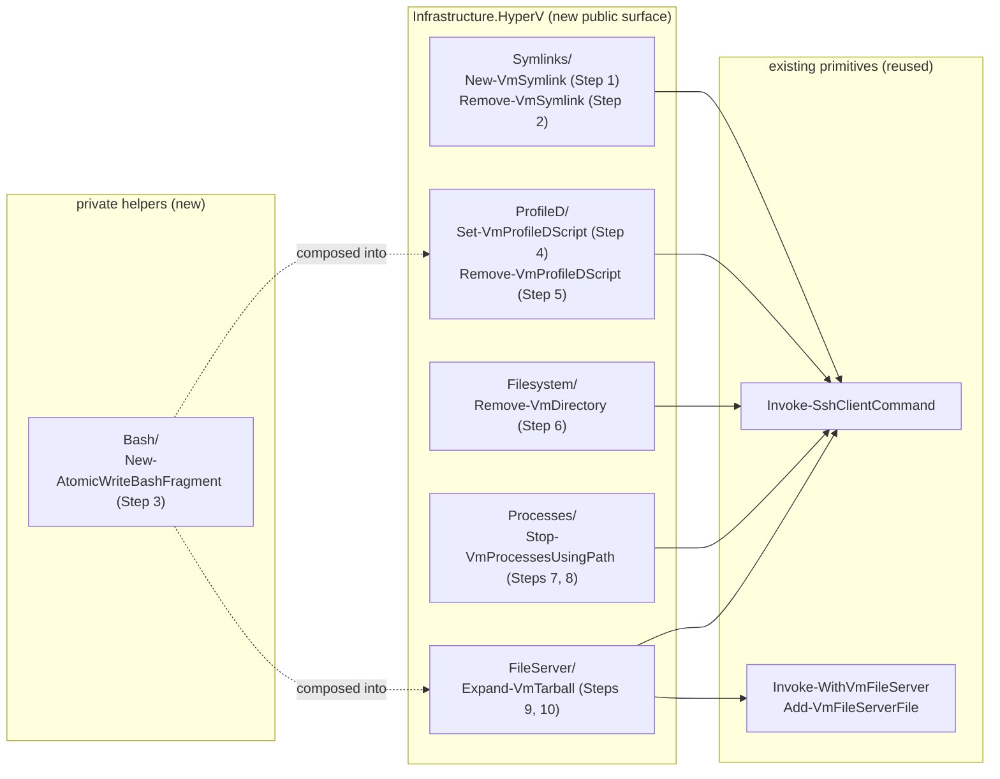
```mermaid
flowchart LR
    subgraph Module ["Infrastructure.HyperV (new public surface)"]
        S1["Symlinks/<br/>New-VmSymlink (Step 1)<br/>Remove-VmSymlink (Step 2)"]
        S2["ProfileD/<br/>Set-VmProfileDScript (Step 4)<br/>Remove-VmProfileDScript (Step 5)"]
        S3["Filesystem/<br/>Remove-VmDirectory (Step 6)"]
        S4["Processes/<br/>Stop-VmProcessesUsingPath (Steps 7, 8)"]
        S5["FileServer/<br/>Expand-VmTarball (Steps 9, 10)"]
    end

    subgraph Private ["private helpers (new)"]
        H["Bash/<br/>New-AtomicWriteBashFragment (Step 3)"]
    end

    subgraph Existing ["existing primitives (reused)"]
        SSH["Invoke-SshClientCommand"]
        FS["Invoke-WithVmFileServer<br/>Add-VmFileServerFile"]
    end

    S1 --> SSH
    S2 --> SSH
    S3 --> SSH
    S4 --> SSH
    S5 --> SSH
    S5 --> FS
    H -.->|composed into| S2
    H -.->|composed into| S5
```

## Step 1: `New-VmSymlink`

**Reason.** Smallest cmdlet in the set, no atomic-write concern, no
remote loops. Lands the test harness shape (mock
`Invoke-SshClientCommand`, capture `-Command`, assert emitted script)
that Steps 2 and 4-10 reuse. The "refuse to overwrite a non-symlink" decision
is exercised first so the conflict-handling pattern is visible to
every subsequent install / removal cmdlet.

**Files.**

- New: `Infrastructure.HyperV/Public/Symlinks/New-VmSymlink.ps1`
- New: `Tests/New-VmSymlink.Tests.ps1`
- Edit: `Infrastructure.HyperV/Infrastructure.HyperV.psm1`
  (`Export-ModuleMember -Function 'New-VmSymlink'`; per-folder
  dot-source loader picks up the new `Symlinks/` subfolder).
- Edit: `Infrastructure.HyperV/Infrastructure.HyperV.psd1`
  (`FunctionsToExport += 'New-VmSymlink'`; bump `ModuleVersion` from
  `0.8.0` to `0.9.0` - additive surface, minor).
- Edit: `README.md` - new section "VM install primitives" with
  `New-VmSymlink` as its first entry; bump
  `Install-Module -MinimumVersion` to `0.9.0`.

**Behaviour.**

- Signature: `New-VmSymlink -SshClient -Path -Target`.
- Host-side validate: `<Path>` and `<Target>` non-empty, absolute, no
  `..` segments, no NUL. Throw before SSH on any failure.
- Single remote script under `set -e`:
  - `if [ -L "$path" ] && [ "$(readlink "$path")" = "$target" ]; then exit 0; fi`
  - `if [ -e "$path" ] || [ -L "$path" ]; then echo "..."; exit 65; fi`
    (caller-error exit code; mapped host-side to a PS exception with
    what was found at the path).
  - `sudo ln -s "$target" "$path"`.
- CRLF -> LF normalisation on the emitted script (matches saved
  feedback on PowerShell here-string line endings tripping bash).
- On non-zero `ExitStatus`, throw with the VM IP, the path, the
  observed type (when exit 65), and the captured stderr.

**Tests (unit).** Mock `Invoke-SshClientCommand`, capture `-Command`.

- Happy path: emitted script contains `set -e`, the readlink-equality
  short-circuit, the conflict guard, and `sudo ln -s`.
- Idempotent shape: assert the short-circuit branch is present (mocked
  SSH returning ExitStatus 0 is silent success).
- Conflict: mocked ExitStatus 65 surfaces as a PS exception naming the
  path; ExitStatus 65 with stderr containing the observed type makes
  it into the exception message.
- Invalid path (relative, contains `..`, contains NUL): throws before
  `Invoke-SshClientCommand` (`Should -Not -Invoke`).
- Invalid target (same shapes): same.
- CRLF -> LF normalisation: emitted command contains no `\r` bytes.

**Mermaid.**

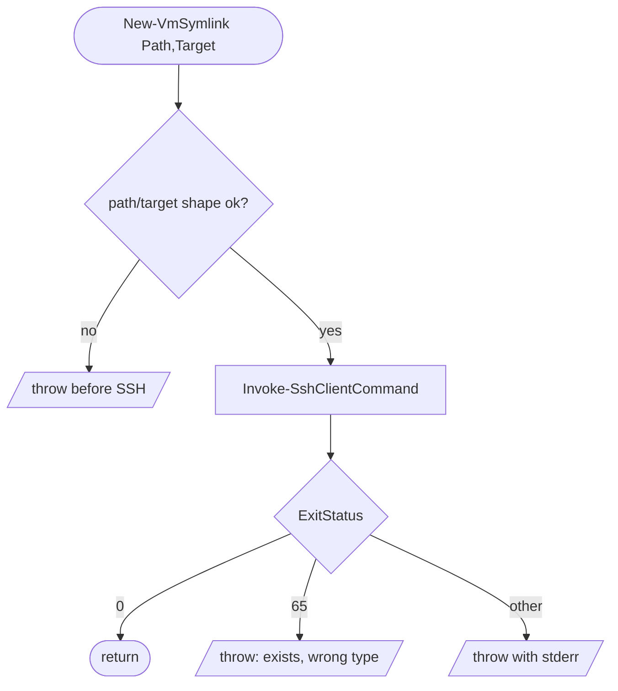
```mermaid
flowchart TD
    Start([New-VmSymlink Path,Target]) --> V{path/target shape ok?}
    V -->|no| ThrowV[/throw before SSH/]
    V -->|yes| Send[Invoke-SshClientCommand]
    Send --> Code{ExitStatus}
    Code -->|0| Done([return])
    Code -->|65| Conflict[/throw: exists, wrong type/]
    Code -->|other| Err[/throw with stderr/]
```

**README.** New section + `New-VmSymlink` row + the `0.9.0` bump.

## Step 2: `Remove-VmSymlink`

**Reason.** Mirrors Step 1 on the removal side and pins the
"refuse-to-delete-non-symlink" half of the conflict pattern. Reuses
Step 1's test harness, so the cmdlet ships small and the
review-of-the-pair completes here.

**Files.**

- New: `Infrastructure.HyperV/Public/Symlinks/Remove-VmSymlink.ps1`
- New: `Tests/Remove-VmSymlink.Tests.ps1`
- Edit: psm1, psd1 (bump `0.9.0` -> `0.10.0`), README.

**Behaviour.**

- Signature: `Remove-VmSymlink -SshClient -Path`.
- Same host-side path validation as Step 1.
- Single remote script under `set -e`:
  - `if [ ! -e "$path" ] && [ ! -L "$path" ]; then exit 0; fi`
  - `if [ ! -L "$path" ]; then echo "..."; exit 65; fi`
  - `sudo rm "$path"`.
- Same error mapping: ExitStatus 65 -> PS exception.

**Tests (unit).**

- Happy path: emitted script contains the existence check, the
  symlink-type check, and `sudo rm`.
- Non-existent: ExitStatus 0 with no `rm` -> silent success.
- Wrong type: ExitStatus 65 surfaces with the path in the message.
- Invalid path: throws before SSH.

**Mermaid.**

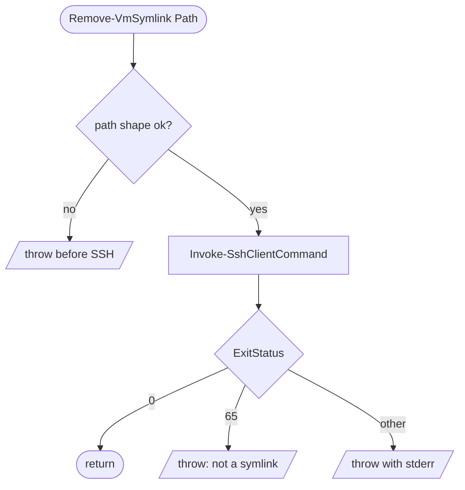
```mermaid
flowchart TD
    Start([Remove-VmSymlink Path]) --> V{path shape ok?}
    V -->|no| ThrowV[/throw before SSH/]
    V -->|yes| Send[Invoke-SshClientCommand]
    Send --> Code{ExitStatus}
    Code -->|0| Done([return])
    Code -->|65| Wrong[/throw: not a symlink/]
    Code -->|other| Err[/throw with stderr/]
```

**README.** New `Remove-VmSymlink` row + the `0.10.0` bump.

## Step 3: Extract atomic-write bash fragment helper

**Reason.** The atomic temp-file + `chown` + `chmod` + `mv` pattern
already lives inline in
[Set-VmEnvironmentVariables](../../../../Infrastructure.HyperV/Public/EnvVars/Set-VmEnvironmentVariables.ps1)
(lines 183-191). Step 4 (`Set-VmProfileDScript`) needs the same shape;
Step 10 (`Expand-VmTarball` skip-unchanged marker) is a third caller.
Three copies of the same 5-line bash snippet is the threshold where
"prefer single source of truth" wins over "avoid premature abstraction"
- a future fix to the pattern (e.g. better tempfile naming, pipefail
handling) should land in one place. Extracting now, before any new
caller is written, means Steps 4 and 10 land using the helper from
day one without a "TODO: refactor" debt.

Lands in `Private/` because it is a code-generation helper that emits
a bash fragment string; it is not a VM-facing primitive itself.

**Files.**

- New: `Infrastructure.HyperV/Private/Bash/New-AtomicWriteBashFragment.ps1`
- New: `Tests/New-AtomicWriteBashFragment.Tests.ps1`
- Edit: `Infrastructure.HyperV/Public/EnvVars/Set-VmEnvironmentVariables.ps1`
  - Replace the inline `TMP=...` / `tee` / `chown` / `chmod` / `mv`
    block with a call to the helper. No behaviour change.
- Edit: `Tests/Set-VmEnvironmentVariables.Tests.ps1`
  - Existing assertions on the emitted script's atomic-write
    fragment must continue to hold byte-for-byte. Add an explicit
    test that the refactored cmdlet's emitted script is identical
    to a captured pre-refactor snapshot (regression guard).
- Edit: `Infrastructure.HyperV/Infrastructure.HyperV.psm1`
  - Per-folder dot-source loader picks up `Private/Bash/`. The
    helper is NOT added to `Export-ModuleMember`.
- Edit: `Infrastructure.HyperV/Infrastructure.HyperV.psd1` - no
  version bump (private surface only; the module's public contract
  is unchanged). Note in the change log that the cmdlet's emitted
  script is unchanged.
- No README edit (no public surface changes).

**Behaviour.**

- Signature:
  ```
  New-AtomicWriteBashFragment
      -TargetPath  <string>           # e.g. /etc/environment, /etc/profile.d/foo.sh
      -ContentVar  <string>           # bash variable name holding the content (no leading $)
      [-Owner      <string> = 'root:root']
      [-Mode       <string> = '0644']
      [-TempDir    <string>]          # default: dirname(TargetPath)
  -> string                           # bash fragment, no trailing newline
  ```
- Host-side validate: `<TargetPath>` non-empty and absolute (no `..`,
  no NUL). `<ContentVar>` matches `^[A-Za-z_][A-Za-z0-9_]*$` (POSIX
  identifier; prevents `$()` / backticks slipping into the emitted
  script). `<Owner>` matches `^[a-z_][a-z0-9_-]*:[a-z_][a-z0-9_-]*$`.
  `<Mode>` matches `^0[0-7]{3,4}$`. Throw on any failure - this is
  a code generator, not a sanitiser; callers do not pass user input
  here.
- Output: a bash snippet of the shape
  ```bash
  TMP="<tempdir>/<basename>.tmp.$$"
  printf '%s\n' "$<ContentVar>" | sudo tee "$TMP" >/dev/null
  sudo chown <Owner> "$TMP"
  sudo chmod <Mode> "$TMP"
  sudo mv "$TMP" "<TargetPath>"
  ```
  with `<TargetPath>`, `<tempdir>`, `<basename>`, `<ContentVar>`,
  `<Owner>`, `<Mode>` substituted host-side. The caller composes this
  into a larger script that defines `<ContentVar>` before this
  fragment runs.
- The fragment assumes the enclosing script already runs under
  `set -euo pipefail` (documented in the help block; the validators
  in Step 4 and Step 10 do this).

**Tests (unit).** Pure-function tests on the returned string.

- Default invocation emits the five-line shape with `root:root`
  ownership and `0644` mode.
- `-Owner` / `-Mode` overrides flow through verbatim.
- `-TempDir` overrides the default temp dir; default is
  `dirname(<TargetPath>)`.
- `-ContentVar` value appears in the `printf` invocation; no `$`
  prefix is required of the caller.
- Invalid `<TargetPath>` (relative, contains `..`, NUL), invalid
  `<ContentVar>` (contains `$`, contains a space, starts with a
  digit), invalid `<Owner>` (missing colon, contains `;`), invalid
  `<Mode>` (missing leading `0`, contains `8`/`9`, too long): one
  case per shape, all throw.
- Refactor regression: a snapshot test in
  `Set-VmEnvironmentVariables.Tests.ps1` captures the emitted script
  before this step's refactor and asserts the post-refactor emitted
  script is byte-identical. The snapshot file
  (`Tests/Snapshots/Set-VmEnvironmentVariables.atomic-write.txt`) is
  checked in as part of this step.

**Mermaid.**

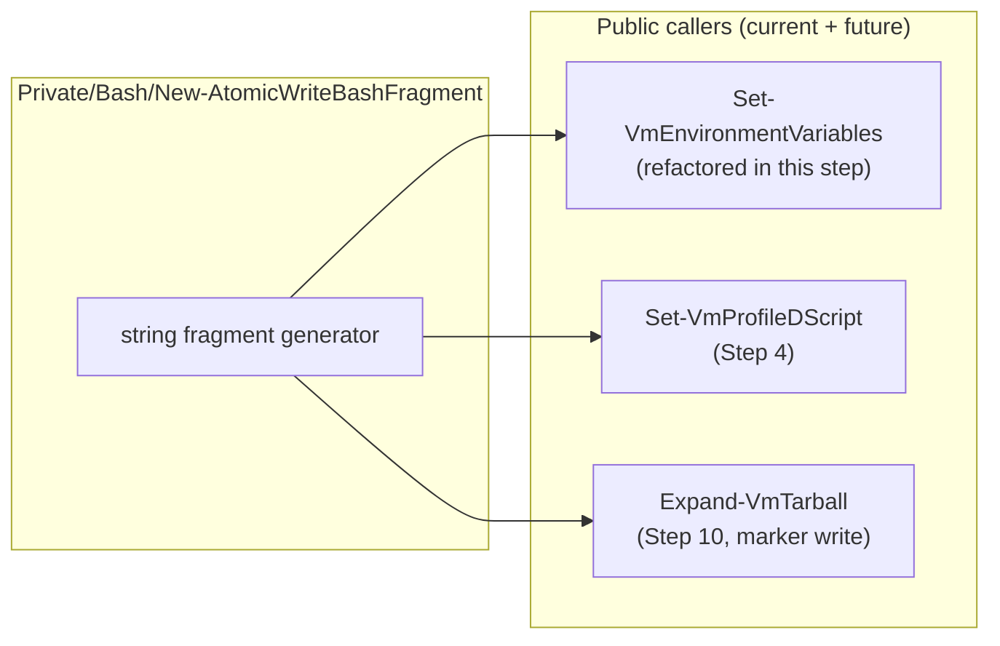
```mermaid
flowchart LR
    subgraph Helper ["Private/Bash/New-AtomicWriteBashFragment"]
        H["string fragment generator"]
    end

    subgraph Callers ["Public callers (current + future)"]
        SVE["Set-VmEnvironmentVariables<br/>(refactored in this step)"]
        SPD["Set-VmProfileDScript<br/>(Step 4)"]
        ET["Expand-VmTarball<br/>(Step 10, marker write)"]
    end

    H --> SVE
    H --> SPD
    H --> ET
```

**README.** No edit (private surface).

**Module parity check.** The shared `Module.Tests.ps1` parity check
(`FunctionsToExport` vs `Export-ModuleMember`) MUST NOT pick up the
new helper - it lives under `Private/` and is dot-sourced but not
exported. The parity test already excludes `Private/` by directory;
add an explicit assertion in this step that
`New-AtomicWriteBashFragment` is reachable inside the module but is
not in `Get-Command -Module Infrastructure.HyperV` output.

## Step 4: `Set-VmProfileDScript`

**Reason.** Re-uses the atomic-write helper from Step 3 instead of
inlining its own copy of the pattern. Lands the byte-equality
skip-unchanged idiom before Step 10's tarball-marker variant so the
"compare-then-skip" pattern is consistent across the module.

**Files.**

- New: `Infrastructure.HyperV/Public/ProfileD/Set-VmProfileDScript.ps1`
- New: `Tests/Set-VmProfileDScript.Tests.ps1`
- Edit: psm1, psd1 (bump `0.10.0` -> `0.11.0`), README.

**Behaviour.**

- Signature:
  `Set-VmProfileDScript -SshClient -Name -Content [-NoSkipUnchanged]`.
- Host-side validate `<Name>`: non-empty, matches
  `^[A-Za-z0-9._-]+$`, no `/`, no `.sh` suffix. Cmdlet appends `.sh`
  to derive `/etc/profile.d/<Name>.sh`.
- Host-side: ensure `<Content>` ends with `\n` (a profile.d script
  without a trailing newline is silently ignored by some POSIX
  shells); append one if missing.
- Remote script under `set -euo pipefail`:
  - Reads existing target if present.
  - Skip-unchanged branch (default): byte-compare existing with
    desired. On match, `exit 0` without `mv`.
  - Otherwise: compose the atomic-write fragment from Step 3's
    `New-AtomicWriteBashFragment` helper (with the target path,
    a `DESIRED` content variable defined in the enclosing script
    via heredoc, `root:root`, `0644`).
- CRLF -> LF normalisation as in Step 1.

**Tests (unit).**

- Happy path: emitted script contains `set -euo pipefail`, the
  reconcile branch, and the atomic-write fragment from the helper
  (assert by composing the expected fragment via the helper and
  searching the emitted script for it byte-for-byte).
- `-NoSkipUnchanged`: emitted script does NOT contain the reconcile
  branch.
- Trailing-newline injection: `<Content>` without a trailing `\n` has
  one added before embedding (assert by searching the emitted script
  for the expected byte sequence).
- Content with `'`, `"`, `$`, backslashes is embedded literally (no
  shell expansion); the cmdlet's escape strategy keeps the bytes
  intact.
- Invalid `<Name>` (empty, contains `/`, ends in `.sh`, contains a
  space, contains `..`): one case per shape, all throw before SSH.

**Mermaid.**

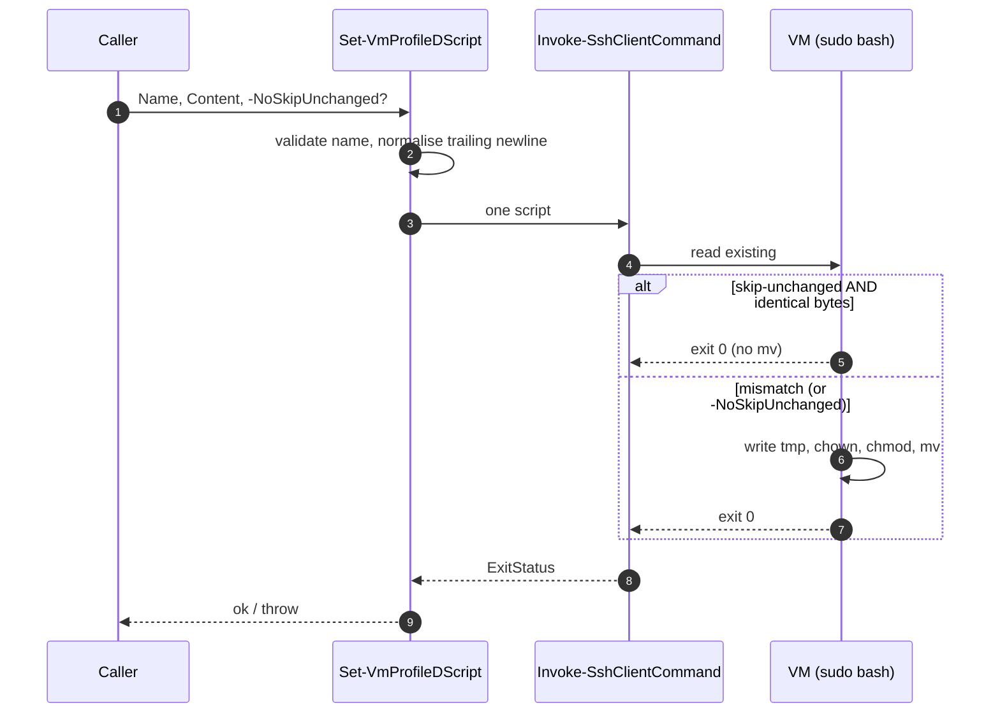
```mermaid
sequenceDiagram
    autonumber
    participant Caller
    participant SPD as Set-VmProfileDScript
    participant SSH as Invoke-SshClientCommand
    participant VM as VM (sudo bash)

    Caller->>SPD: Name, Content, -NoSkipUnchanged?
    SPD->>SPD: validate name, normalise trailing newline
    SPD->>SSH: one script
    SSH->>VM: read existing
    alt skip-unchanged AND identical bytes
        VM-->>SSH: exit 0 (no mv)
    else mismatch (or -NoSkipUnchanged)
        VM->>VM: write tmp, chown, chmod, mv
        VM-->>SSH: exit 0
    end
    SSH-->>SPD: ExitStatus
    SPD-->>Caller: ok / throw
```

**README.** New `Set-VmProfileDScript` row + the `0.11.0` bump.

## Step 5: `Remove-VmProfileDScript`

**Reason.** Mirrors Step 4 on the removal side. No atomic write
needed (`rm` of one file is atomic at the directory-entry level).
Reuses Step 4's name-validation helper, so the diff is narrow.

**Files.**

- New: `Infrastructure.HyperV/Public/ProfileD/Remove-VmProfileDScript.ps1`
- New: `Tests/Remove-VmProfileDScript.Tests.ps1`
- Edit: psm1, psd1 (bump `0.11.0` -> `0.12.0`), README.

**Behaviour.**

- Signature: `Remove-VmProfileDScript -SshClient -Name`.
- Same `<Name>` validation as Step 4 (factored into a private helper
  in this step if not already; if Step 4 inlined it, this step
  extracts it).
- Remote script under `set -e`: if `/etc/profile.d/<Name>.sh` exists,
  `sudo rm`; otherwise `exit 0`.

**Tests (unit).**

- Happy path: emitted script contains the existence check and
  `sudo rm`.
- Absent target: ExitStatus 0 with no `rm` -> silent success.
- Invalid `<Name>`: throws before SSH (same matrix as Step 4, abridged
  to one case per shape since the helper is shared).

**Mermaid.**

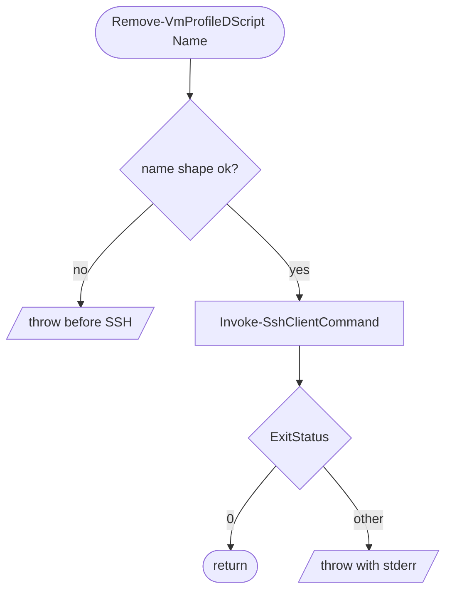
```mermaid
flowchart TD
    Start([Remove-VmProfileDScript Name]) --> V{name shape ok?}
    V -->|no| ThrowV[/throw before SSH/]
    V -->|yes| Send[Invoke-SshClientCommand]
    Send --> Code{ExitStatus}
    Code -->|0| Done([return])
    Code -->|other| Err[/throw with stderr/]
```

**README.** New `Remove-VmProfileDScript` row + the `0.12.0` bump.

## Step 6: `Remove-VmDirectory`

**Reason.** Closes the uninstall path for current consumers
([Uninstall-Jdk](../../../../../Infrastructure-Vm-Provisioner/hyper-v/ubuntu/up/post/Uninstall-Jdk.ps1)
does `sudo rm -rf /opt/jdk-*` as a heredoc) and the planned
[42 - dotnet sdk](../../../../../Infrastructure-Vm-Provisioner/docs/dev/implementation/42%20-%20dotnet%20sdk/problem.md)
reconciler. The allowlist guard is the security review for "this
module can `rm -rf` on a VM"; landing it as its own step keeps that
review on a focused diff.

**Files.**

- New: `Infrastructure.HyperV/Public/Filesystem/Remove-VmDirectory.ps1`
- New: `Tests/Remove-VmDirectory.Tests.ps1`
- Edit: psm1, psd1 (bump `0.12.0` -> `0.13.0`), README.

**Behaviour.**

- Signature: `Remove-VmDirectory -SshClient -Path`.
- Host-side validate `<Path>`:
  - Absolute, non-empty, no `..` segments, no NUL.
  - Starts with one of the allowlisted parent prefixes (each followed
    by `/`): `/opt/`, `/var/lib/infra-provisioner/`,
    `/usr/local/share/`. The trailing `/` requirement prevents
    `/optimist` from matching `/opt`.
  - Not equal to (or a prefix-ancestor of) any literal in the denylist:
    `/`, `/usr`, `/usr/local`, `/etc`, `/home`, `/var`, `/var/lib`,
    `/root`, `/boot`, `/lib`, `/lib64`, `/sbin`, `/bin`, `/proc`,
    `/sys`, `/dev`, `/run`, `/tmp`.
- All allowlist / denylist entries are script-scope constants at the
  top of the file, exercised by enumeration in the unit tests so any
  extension shows up in diffs.
- Remote script under `set -e`:
  - If `<Path>` does not exist: `exit 0`.
  - If exists and is not a directory: emit a message naming what was
    found, `exit 65`.
  - Else: `sudo rm -rf -- "$path"`.

**Tests (unit).**

- Allowlist positive cases (one each): `/opt/foo`,
  `/var/lib/infra-provisioner/manifests/x.json`, `/usr/local/share/y`.
  Each emits a script containing `sudo rm -rf --`.
- Allowlist negative cases enumerating every denylist literal plus:
  `/optimist`, `/opt`, `/var/lib`, `/etc/passwd`, `/home/user`,
  `relative/path`, `/opt/../etc`, empty string, `/opt/foo\0bar`. All
  throw with the offending path in the message before SSH.
- Remote-side existing-directory: ExitStatus 0 -> silent success.
- Remote-side non-existent: ExitStatus 0 -> silent success.
- Remote-side wrong type (mocked ExitStatus 65): PS exception naming
  the path.
- Allowlist / denylist constants enumeration test: fails if a literal
  is added without a corresponding case (uses reflection-style
  iteration over the script-scope arrays).

**Mermaid.**

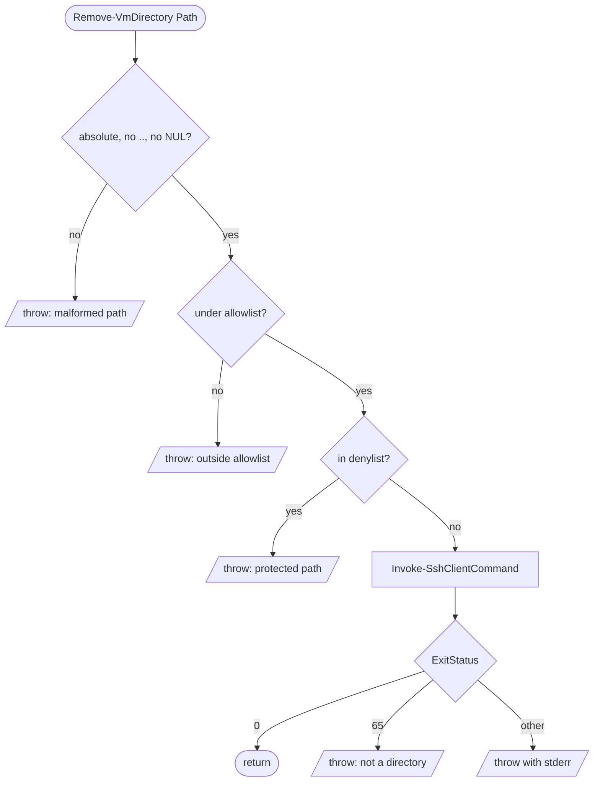
```mermaid
flowchart TD
    Start([Remove-VmDirectory Path]) --> V1{absolute, no .., no NUL?}
    V1 -->|no| Throw1[/throw: malformed path/]
    V1 -->|yes| V2{under allowlist?}
    V2 -->|no| Throw2[/throw: outside allowlist/]
    V2 -->|yes| V3{in denylist?}
    V3 -->|yes| Throw3[/throw: protected path/]
    V3 -->|no| Send[Invoke-SshClientCommand]
    Send --> Code{ExitStatus}
    Code -->|0| Done([return])
    Code -->|65| Wrong[/throw: not a directory/]
    Code -->|other| Err[/throw with stderr/]
```

**README.** New `Remove-VmDirectory` row with a note that the
allowlist is hard-coded + the `0.13.0` bump.

## Step 7: `Stop-VmProcessesUsingPath` (SIGTERM-only)

**Reason.** Splits the cmdlet across two commits because the SIGKILL
fallback + STILL_ALIVE branch is the harder half of the logic and
merits a focused review. The SIGTERM-only version is already useful
for callers that tolerate "leave survivors behind" semantics (e.g.
a soft drain). Lands the scanner, the PID extraction, and the result
shape; Step 8 adds the escalation.

**Files.**

- New: `Infrastructure.HyperV/Public/Processes/Stop-VmProcessesUsingPath.ps1`
- New: `Tests/Stop-VmProcessesUsingPath.Tests.ps1`
- Edit: psm1, psd1 (bump `0.13.0` -> `0.14.0`), README.

**Behaviour.**

- Signature:
  `Stop-VmProcessesUsingPath -SshClient -Path -GraceSeconds`.
- Host-side validate `<Path>` (absolute, no NUL, non-empty).
  `<GraceSeconds>` is a non-negative integer.
- Remote script under `set -euo pipefail`:
  - Scanner with fallbacks: prefer `lsof +D "$path"`; fall back to
    `fuser -m "$path"`; final fallback iterates `/proc/*/exe`,
    `/proc/*/cwd`, `/proc/*/maps`.
  - If no PIDs: print `TERMINATED= KILLED= STILL_ALIVE=` and `exit 0`.
  - Otherwise: `sudo kill -TERM <pids>`. Poll `kill -0` at 0.5s
    intervals up to `<GraceSeconds>`.
  - Survivors at end of grace are reported in `STILL_ALIVE`; no
    SIGKILL in this step.
  - Print `TERMINATED=<ids> KILLED= STILL_ALIVE=<ids>`. KILLED is
    always empty in this step (the field exists in the output shape
    for forward compatibility with Step 7).
  - Exit 0 if STILL_ALIVE empty; exit 64 otherwise.
- Host-side: parse stdout, emit
  `[PSCustomObject]@{ TerminatedPids; KilledPids; StillAlive }`.
  Throw with the result on exit 64 so callers cannot silently ignore
  stuck processes.

**Tests (unit).**

- Empty result: stdout `TERMINATED= KILLED= STILL_ALIVE=` -> object
  with three empty arrays.
- All terminated: stdout `TERMINATED=101 102 KILLED= STILL_ALIVE=` ->
  TerminatedPids = `[101,102]`.
- Some survivors: stdout `TERMINATED=101 KILLED= STILL_ALIVE=202` +
  ExitStatus 64 -> PS exception carrying the result; message contains
  `202`.
- Emitted script contains all three scanner branches in the right
  preference order.
- `<GraceSeconds>` 0: emitted script's poll loop is absent.
- Invalid `<Path>` / negative `<GraceSeconds>` throw before SSH.
- KILLED field is hard-coded empty in this step (assert on the
  emitted script's `KILLED=` literal); Step 8 will lift this.

**Mermaid.**

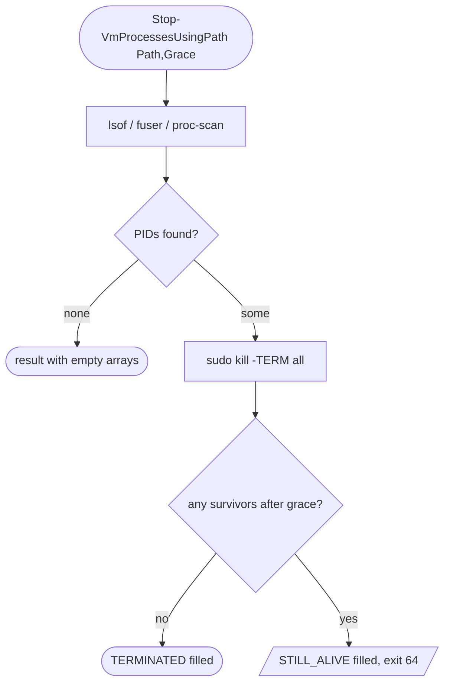
```mermaid
flowchart TD
    Start([Stop-VmProcessesUsingPath Path,Grace]) --> Scan[lsof / fuser / proc-scan]
    Scan --> Pids{PIDs found?}
    Pids -->|none| Empty([result with empty arrays])
    Pids -->|some| Term[sudo kill -TERM all]
    Term --> Poll{any survivors after grace?}
    Poll -->|no| OkT([TERMINATED filled])
    Poll -->|yes| Stuck[/STILL_ALIVE filled, exit 64/]
```

**README.** New row with a note that this step is SIGTERM-only +
forward reference to Step 8 + the `0.14.0` bump.

## Step 8: Add SIGKILL fallback to `Stop-VmProcessesUsingPath`

**Reason.** Closes the cmdlet's contract from problem.md (KILLED is
the second tier of the tri-state result). Lands as its own commit so
the SIGKILL escalation review is small and orthogonal to the scanner
logic.

**Files.**

- Edit: `Infrastructure.HyperV/Public/Processes/Stop-VmProcessesUsingPath.ps1`
- Edit: `Tests/Stop-VmProcessesUsingPath.Tests.ps1`
- Edit: psd1 (bump `0.14.0` -> `0.15.0`), README.

**Behaviour delta.**

- After the SIGTERM poll: `sudo kill -KILL` any survivors.
- Poll `kill -0` for up to 5 seconds (kernel reap window).
- Reaped survivors are reported in KILLED; still-unreaped are in
  STILL_ALIVE; exit 64 only when STILL_ALIVE is non-empty.

**Tests (unit), additions.**

- `kill -TERM` survivors that exit during grace -> still in
  TerminatedPids; KILLED empty.
- `kill -TERM` survivors that DO NOT exit during grace and ARE reaped
  after SIGKILL -> in KilledPids; STILL_ALIVE empty; ExitStatus 0.
- `kill -TERM` survivors that survive SIGKILL too (uninterruptible
  sleep) -> in STILL_ALIVE; ExitStatus 64; PS exception with the
  full result.
- Emitted script now contains the SIGKILL branch and the 5s reap
  poll (assert on the script text).

**Mermaid.**

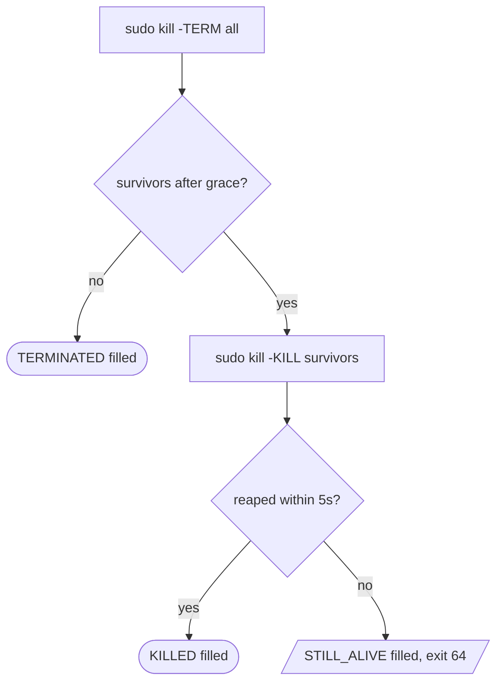
```mermaid
flowchart TD
    Term[sudo kill -TERM all] --> PollT{survivors after grace?}
    PollT -->|no| OkT([TERMINATED filled])
    PollT -->|yes| Kill[sudo kill -KILL survivors]
    Kill --> PollK{reaped within 5s?}
    PollK -->|yes| OkK([KILLED filled])
    PollK -->|no| Stuck[/STILL_ALIVE filled, exit 64/]
```

**README.** Update the existing row to drop the "SIGTERM-only" caveat
+ the `0.15.0` bump.

## Step 9: `Expand-VmTarball` (extract-always)

**Reason.** Largest cmdlet in the set. Splits across two steps so the
extract-then-mv path lands and reviews on its own, before Step 10
layers on the SHA-256 marker + skip-unchanged. The extract-always
version is fully functional - it just re-extracts every run.

**Files.**

- New: `Infrastructure.HyperV/Public/FileServer/Expand-VmTarball.ps1`
  (joins `Add-VmFileServerFile` and `Invoke-WithVmFileServer` in the
  existing `FileServer/` folder).
- New: `Tests/Expand-VmTarball.Tests.ps1`
- Edit: psm1, psd1 (bump `0.15.0` -> `0.16.0`), README.

**Behaviour.**

- Signature:
  `Expand-VmTarball -SshClient -Server -TarballPath -Destination [-StripComponents <int>]`.
- Host-side validate: `<TarballPath>` exists; `<Destination>`
  absolute, no `..`, no NUL; `<StripComponents>` non-negative integer
  (default 0).
- `Add-VmFileServerFile -Server $Server -LocalPath $TarballPath`
  returns a URL.
- Remote script under `set -euo pipefail`:
  - `mktemp -d "$(dirname "$destination")/.expand.XXXXXX"`.
  - `curl -fsSL "$url" | sudo tar -xzf - -C "$tmpdir" --strip-components="$strip"`.
  - If `<Destination>` exists: `sudo rm -rf -- "$destination"`.
  - `sudo mv "$tmpdir" "$destination"`.
- No skip-unchanged in this step (every call extracts).

**Tests (unit).**

- Happy path: emitted script contains the `mktemp` in
  `<Destination>`'s parent, `curl | tar` with `--strip-components`,
  and the `mv`.
- `-StripComponents` value (0, 1, 2) flows through verbatim; default
  is 0.
- Existing destination: emitted script removes it before `mv`.
- Invalid `<Destination>`: throws before SSH.
- Missing `<TarballPath>` on host: throws before
  `Add-VmFileServerFile`.
- `Add-VmFileServerFile` throwing surfaces; `Invoke-SshClientCommand`
  is not called.

**Mermaid.**

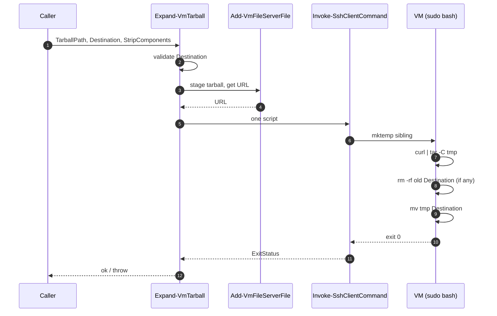
```mermaid
sequenceDiagram
    autonumber
    participant Caller
    participant ET as Expand-VmTarball
    participant FS as Add-VmFileServerFile
    participant SSH as Invoke-SshClientCommand
    participant VM as VM (sudo bash)

    Caller->>ET: TarballPath, Destination, StripComponents
    ET->>ET: validate Destination
    ET->>FS: stage tarball, get URL
    FS-->>ET: URL
    ET->>SSH: one script
    SSH->>VM: mktemp sibling
    VM->>VM: curl | tar -C tmp
    VM->>VM: rm -rf old Destination (if any)
    VM->>VM: mv tmp Destination
    VM-->>SSH: exit 0
    SSH-->>ET: ExitStatus
    ET-->>Caller: ok / throw
```

**README.** New `Expand-VmTarball` row with a note that
skip-unchanged lands in the next minor + the `0.16.0` bump.

## Step 10: Add skip-unchanged marker to `Expand-VmTarball`

**Reason.** Closes the cmdlet's contract from problem.md. The marker
file is the smallest piece of metadata that survives across runs and
identifies the source tarball uniquely - SHA-256 is over the tarball
bytes, computed host-side once. The marker write itself composes the
atomic-write helper from Step 3.

**Files.**

- Edit: `Infrastructure.HyperV/Public/FileServer/Expand-VmTarball.ps1`
- Edit: `Tests/Expand-VmTarball.Tests.ps1`
- Edit: psd1 (bump `0.16.0` -> `0.17.0`), README.

**Behaviour delta.**

- Signature gains `[-NoSkipUnchanged]`.
- Host-side: compute SHA-256 of `<TarballPath>` once.
- Remote script grows a pre-check at the top:
  - If `<Destination>/.infra-hyperv-tarball.sha256` exists and matches
    the host-computed digest and skip-unchanged is on (default):
    `exit 0` before any `curl` / `tar` / `mv`.
- The `mktemp` / `curl` / `tar` branch now also writes
  `$tmpdir/.infra-hyperv-tarball.sha256` (host-computed digest) before
  the `mv`.

**Tests (unit), additions.**

- Skip-unchanged on (default), simulated digest match (mocked SSH
  returning the early-exit path's exit 0): assert the emitted script
  contains the marker-file check.
- `-NoSkipUnchanged`: emitted script does NOT contain the early-exit
  branch (still contains the marker write inside the tempdir).
- Marker write: emitted script writes the host-computed digest into
  `<tmpdir>/.infra-hyperv-tarball.sha256` before `mv`.
- SHA-256 fixture: a small canned tarball on disk produces a known
  digest, which appears verbatim in the emitted script.
- SHA-256 computed once per call (assert with two calls and a SHA
  helper that counts invocations).

**Mermaid.**

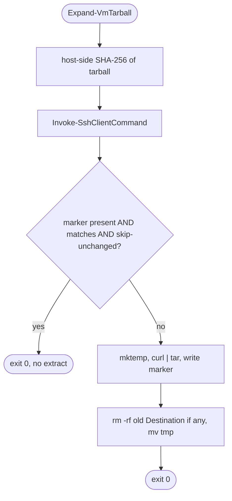
```mermaid
flowchart TD
    Start([Expand-VmTarball]) --> SHA[host-side SHA-256 of tarball]
    SHA --> Send[Invoke-SshClientCommand]
    Send --> Marker{marker present AND matches AND skip-unchanged?}
    Marker -->|yes| Done([exit 0, no extract])
    Marker -->|no| Extract["mktemp, curl | tar, write marker"]
    Extract --> Replace["rm -rf old Destination if any, mv tmp"]
    Replace --> Ok([exit 0])
```

**README.** Update the `Expand-VmTarball` row to drop the "no
skip-unchanged" caveat + the `0.17.0` bump.

## Step 11: Integration tests for symlinks

**Reason.** Unit tests pin the emitted script shape; only a live
VM-side run can prove the conflict guards behave under real shells
and that ownership / mode end up correct. Mirrors the integration
split used by
[03 - vm-environment-variables Step 4](../03%20-%20vm-environment-variables/plan.md#step-4-integration-tests-against-the-docker-target).

**Files.**

- New: `Tests/Integration.DockerTarget/New-VmSymlink.Tests.ps1`
- New: `Tests/Integration.DockerTarget/Remove-VmSymlink.Tests.ps1`

**Scenarios.** Each verified by reading state back via
`Invoke-SshClientCommand`.

1. `New-VmSymlink` creates a symlink under `/usr/local/bin/`, owner
   `root:root`, target resolves via `readlink -f`.
2. Identical re-run: mtime of the symlink unchanged (idempotent).
3. Re-run with different target: throws "exists with different
   target"; original symlink is untouched.
4. Pre-create a regular file at `<Path>`; `New-VmSymlink` throws
   "exists as regular file"; the file is byte-identical after.
5. `Remove-VmSymlink` on the link from (1): gone.
6. `Remove-VmSymlink` on a non-existent path: no-op.
7. `Remove-VmSymlink` on a regular file: throws; file is
   byte-identical after.

**Mermaid.**

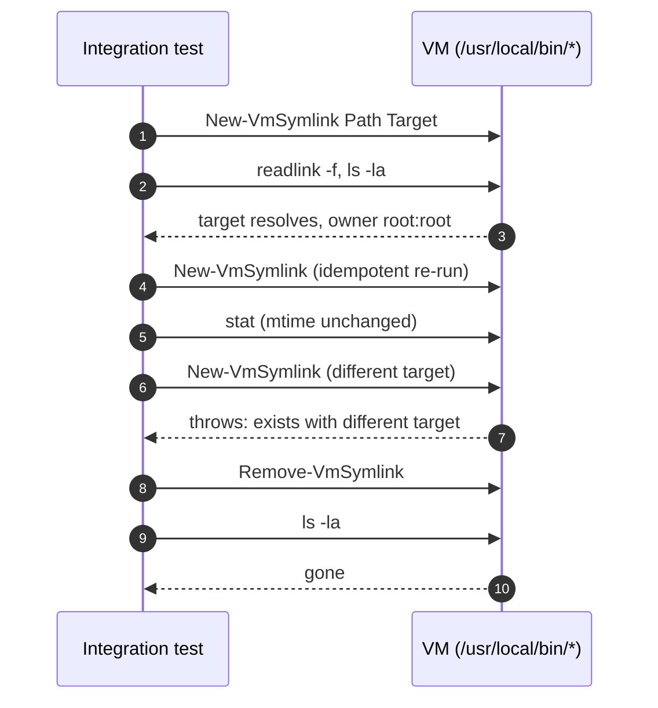
```mermaid
sequenceDiagram
    autonumber
    participant T as Integration test
    participant VM as VM (/usr/local/bin/*)

    T->>VM: New-VmSymlink Path Target
    T->>VM: readlink -f, ls -la
    VM-->>T: target resolves, owner root:root
    T->>VM: New-VmSymlink (idempotent re-run)
    T->>VM: stat (mtime unchanged)
    T->>VM: New-VmSymlink (different target)
    VM-->>T: throws: exists with different target
    T->>VM: Remove-VmSymlink
    T->>VM: ls -la
    VM-->>T: gone
```

**README.** No edit.

## Step 12: Integration tests for profile.d

**Reason.** Live-shell verification of the atomic write, the
skip-unchanged byte comparison, and the round-trip of values that
contain shell metacharacters. Mirrors Step 11's shape.

**Files.**

- New: `Tests/Integration.DockerTarget/Set-VmProfileDScript.Tests.ps1`
- New: `Tests/Integration.DockerTarget/Remove-VmProfileDScript.Tests.ps1`

**Scenarios.**

1. First-run create at `/etc/profile.d/test.sh` with
   `export FOO=1\n`. Owner `root:root`, mode `0644`, content
   byte-equal.
2. Identical re-run with skip-unchanged on: file mtime unchanged.
3. `-NoSkipUnchanged`: mtime advances; content byte-equal.
4. Different content: mtime advances; content byte-equal to new
   desired.
5. `Remove-VmProfileDScript`: file gone.
6. `Remove-VmProfileDScript` on absent: no-op.
7. Content with `'`, `"`, `$`, backslashes round-trips: read-back
   matches input byte-for-byte.

**Mermaid.**

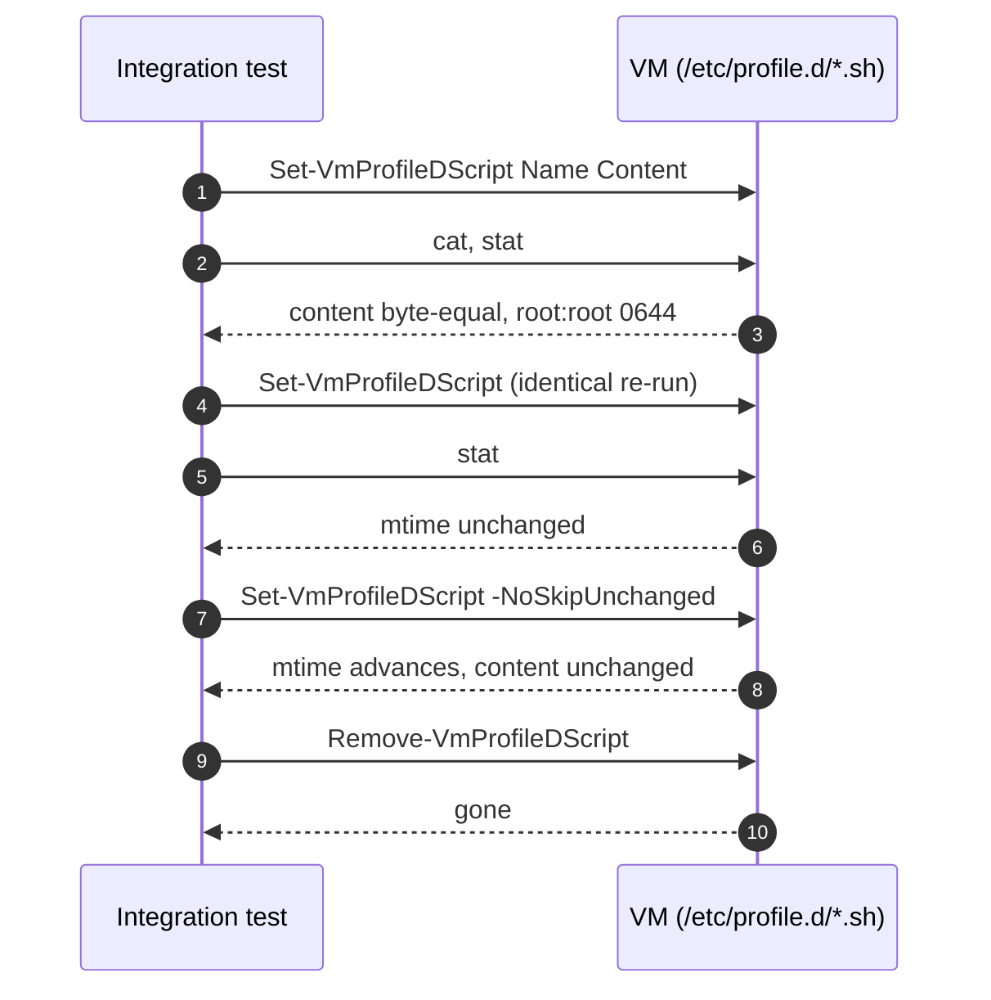
```mermaid
sequenceDiagram
    autonumber
    participant T as Integration test
    participant VM as VM (/etc/profile.d/*.sh)

    T->>VM: Set-VmProfileDScript Name Content
    T->>VM: cat, stat
    VM-->>T: content byte-equal, root:root 0644
    T->>VM: Set-VmProfileDScript (identical re-run)
    T->>VM: stat
    VM-->>T: mtime unchanged
    T->>VM: Set-VmProfileDScript -NoSkipUnchanged
    VM-->>T: mtime advances, content unchanged
    T->>VM: Remove-VmProfileDScript
    VM-->>T: gone
```

**README.** No edit.

## Step 13: Integration tests for `Remove-VmDirectory`

**Reason.** The allowlist and denylist literal lists need real-VM
verification that the rejected paths are still present after a
blocked call, and that the accepted paths are gone after an allowed
call. Pure-unit testing cannot prove the negative ("did not touch the
VM").

**Files.**

- New: `Tests/Integration.DockerTarget/Remove-VmDirectory.Tests.ps1`

**Scenarios.**

1. Pre-create `/opt/integration-test-dir/` with files inside. Call
   cmdlet: dir gone.
2. Re-run on the same path: no-op, does not throw.
3. Pre-create `/opt/integration-test-file` (regular file). Call
   cmdlet: throws "not a directory"; the file is byte-identical
   after.
4. `/etc/cron.d` (denylisted): throws before SSH; `/etc/cron.d` and
   its contents are unchanged on the VM (verified via `ls -la`
   snapshot before / after).
5. `/optimist` pre-created on the VM: throws before SSH; the dir is
   present after (proves the trailing-slash prefix rule).
6. `/opt/foo/../etc/passwd`: throws before SSH; `/etc/passwd` is
   byte-identical after.

**Mermaid.**

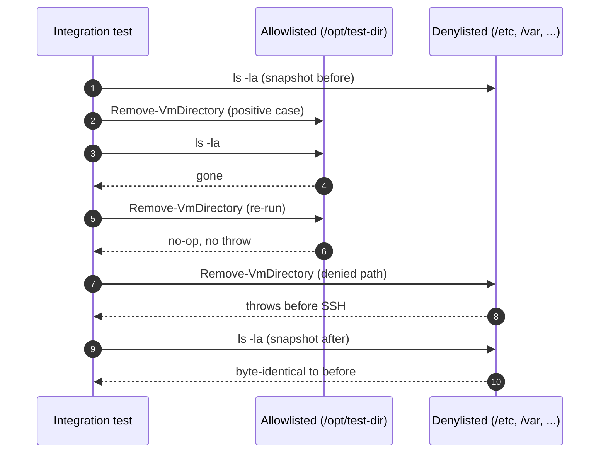
```mermaid
sequenceDiagram
    autonumber
    participant T as Integration test
    participant Allow as Allowlisted (/opt/test-dir)
    participant Sys as Denylisted (/etc, /var, ...)

    T->>Sys: ls -la (snapshot before)
    T->>Allow: Remove-VmDirectory (positive case)
    T->>Allow: ls -la
    Allow-->>T: gone
    T->>Allow: Remove-VmDirectory (re-run)
    Allow-->>T: no-op, no throw
    T->>Sys: Remove-VmDirectory (denied path)
    Sys-->>T: throws before SSH
    T->>Sys: ls -la (snapshot after)
    Sys-->>T: byte-identical to before
```

**README.** No edit.

## Step 14: Integration tests for `Stop-VmProcessesUsingPath`

**Reason.** The two-stage TERM-then-KILL escalation, the structured
result, and the scanner fallbacks cannot be proven without real
processes. Uses fixture `sleep` processes with controllable SIGTERM
handling.

**Files.**

- New: `Tests/Integration.DockerTarget/Stop-VmProcessesUsingPath.Tests.ps1`

**Scenarios.**

1. No processes hold any file under
   `/opt/integration-test-process-dir/`: result has all three lists
   empty.
2. Pre-spawn `sleep 600` whose cwd is the target dir. Call with
   `-GraceSeconds 3`: PID is in `TerminatedPids` (sleep handles
   SIGTERM); process is gone.
3. Pre-spawn `bash -c 'trap "" TERM; sleep 600'` in the dir. Call
   with `-GraceSeconds 2`: PID is in `KilledPids` after SIGKILL;
   process is gone.
4. Pre-spawn `sleep 600` outside the dir. Call cmdlet: that process
   is NOT in any of the three lists; `kill -0` against its PID still
   succeeds after the call.
5. `-GraceSeconds 0` with a SIGTERM-trapping process: PID goes
   straight to `KilledPids`.
6. Scanner-fallback case: temporarily mask `lsof` (PATH override) and
   re-run scenario 2; the `fuser` branch is taken; result is
   identical.

**Mermaid.**

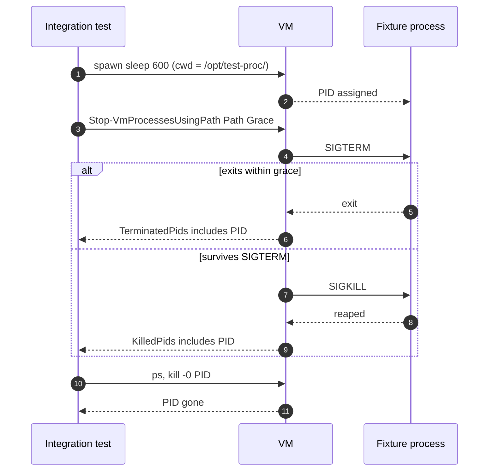
```mermaid
sequenceDiagram
    autonumber
    participant T as Integration test
    participant VM as VM
    participant Pr as Fixture process

    T->>VM: spawn sleep 600 (cwd = /opt/test-proc/)
    VM-->>Pr: PID assigned
    T->>VM: Stop-VmProcessesUsingPath Path Grace
    VM->>Pr: SIGTERM
    alt exits within grace
        Pr-->>VM: exit
        VM-->>T: TerminatedPids includes PID
    else survives SIGTERM
        VM->>Pr: SIGKILL
        Pr-->>VM: reaped
        VM-->>T: KilledPids includes PID
    end
    T->>VM: ps, kill -0 PID
    VM-->>T: PID gone
```

**README.** No edit.

## Step 15: Integration tests for `Expand-VmTarball`

**Reason.** Verifies the atomic extract under a real `tar`, the
skip-unchanged marker survives across runs, the replace-existing
branch is truly atomic (no observable half-extracted state), and the
tempdir-orphan cleanup behaves on a simulated crash.

**Files.**

- New: `Tests/Integration.DockerTarget/Expand-VmTarball.Tests.ps1`
- Fixture: a small known tarball checked into the test tree (or
  generated host-side at test start from known content).

**Scenarios.**

1. First-run: extracts to a fresh `/opt/integration-test-tarball/`;
   contents match the tarball; marker file is present with the host
   digest.
2. Identical re-run: marker matches; directory mtime unchanged.
3. `-NoSkipUnchanged`: re-extracts; mtime advances; content
   unchanged.
4. Different tarball: destination is replaced atomically (a marker
   file unique to the OLD tarball is gone; one unique to the NEW
   tarball is present).
5. `-StripComponents 1` on a tarball whose root is one
   `tarball-root/` dir: the wrapper level is stripped.
6. Crash simulation: inject `kill -9 $$` into the remote script via
   a test hook. Assert `<Destination>` is unchanged after; an orphan
   `.expand.*` tempdir remains as a sibling. Next clean run with
   `-NoSkipUnchanged` succeeds and the orphan tempdir is gone.

**Mermaid.**

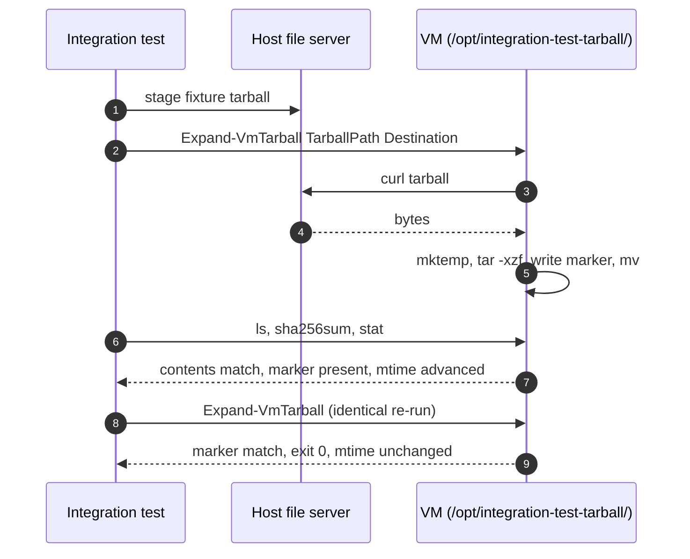
```mermaid
sequenceDiagram
    autonumber
    participant T as Integration test
    participant FS as Host file server
    participant VM as VM (/opt/integration-test-tarball/)

    T->>FS: stage fixture tarball
    T->>VM: Expand-VmTarball TarballPath Destination
    VM->>FS: curl tarball
    FS-->>VM: bytes
    VM->>VM: mktemp, tar -xzf, write marker, mv
    T->>VM: ls, sha256sum, stat
    VM-->>T: contents match, marker present, mtime advanced
    T->>VM: Expand-VmTarball (identical re-run)
    VM-->>T: marker match, exit 0, mtime unchanged
```

**README.** No edit.
